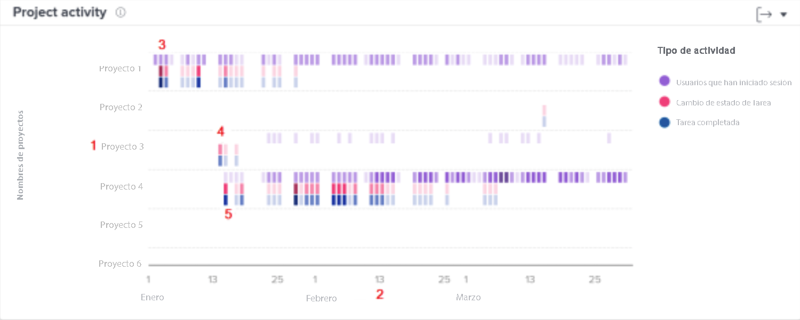

# Explicación de la navegación y revisión de la actividad del proyecto

Este vídeo contiene información sobre:

* Cómo comparar proyectos en función de usuarios que han iniciado sesión, cambios de estado de tareas y tareas completadas

>[!VIDEO](https://video.tv.adobe.com/v/3437439/?quality=12&learn=on&enablevpops=1&captions=spa)

## Comparar trabajo de proyecto

El gráfico de actividad del proyecto permite comprender y comparar las actividades del proyecto (usuarios que han iniciado la sesión, cambios de estado de tareas y tareas completadas) con las de otros proyectos de Workfront. Las actividades del proyecto se muestran en diferentes colores para resumir las actividades a lo largo de un período de tiempo.

Ver esta información le ayuda a determinar lo siguiente:

* La actividad de un proyecto específico.
* La actividad de un proyecto en comparación con otros proyectos.
* Qué usuarios están trabajando en un proyecto y con qué frecuencia.

En el gráfico, puede ver lo siguiente:

1. Nombres de los proyectos a la izquierda.
1. Las fechas se muestran en la parte inferior.
1. Las casillas moradas muestran que los usuarios asignados al proyecto han iniciado la sesión ese día, el tono más oscuro indica que un mayor número de usuarios han iniciado sesión.
1. Las casillas rosadas muestran que los usuarios han cambiado el estado de una tarea para el proyecto ese día, un tono más oscuro indica que ha cambiado un número mayor de estados de las tareas.
1. Las casillas azules muestran que los usuarios han completado una tarea para el proyecto, un tono más oscuro indica un mayor número de tareas completadas.
