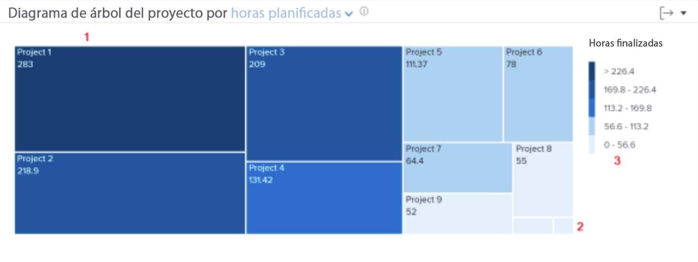

# Profundizar en la navegación en [!UICONTROL Análisis mejorado]

En este vídeo, aprenderá lo siguiente:

* Cómo ver rápidamente cuánto tiempo dedican los trabajadores a cada proyecto

>[!VIDEO](https://video.tv.adobe.com/v/335050/?quality=12)

## Revisar el tiempo empleado en los proyectos

El diagrama de proyecto le permite comprender cuánto tiempo han dedicado los usuarios a un proyecto. Los cuadros representan proyectos. El tamaño del cuadro muestra cuánto tiempo se ha invertido en el proyecto en comparación con otros proyectos. Cuanto más grande sea la caja, más tiempo pasará.

Ver esta información le ayuda a determinar lo siguiente:

* Prioridad de los elementos en los que se trabaja durante el intervalo de fechas seleccionado.
* En qué dedican tiempo los usuarios.
* Si los usuarios se centran en las cosas correctas.
* Cuánto cambió el ámbito de un proyecto durante ese período de tiempo cuando se selecciona un proyecto específico.

En el gráfico puede ver lo siguiente:

1. Los proyectos en el tiempo filtrado que tienen más horas completadas se representan con cuadros más grandes y un color azul oscuro.
1. Los proyectos en el tiempo filtrado que tienen menos horas completadas se representan con cuadros más pequeños y un color azul claro.
1. El pie de ilustración a la derecha del gráfico muestra el intervalo de horas completadas para cada tono de azul.
