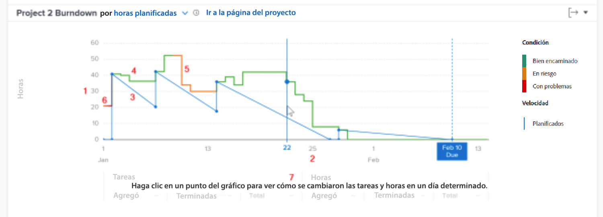

# Comprender el acceso y la revisión del desglose

Este vídeo contiene información sobre:

* Cómo acceder al gráfico de evolución
* Comprender la relación entre las horas restantes, la condición del proyecto y la velocidad de un proyecto

>[!VIDEO](https://video.tv.adobe.com/v/3438887/?quality=12&learn=on&enablevpops=1&captions=spa)

## Seguimiento de la velocidad del proyecto

El gráfico de evolución le permite comprender la relación entre las horas restantes, la condición del proyecto y la velocidad. La línea sólida muestra las horas dedicadas al proyecto a lo largo del tiempo, así como el estado del proyecto cada día. La línea discontinua (que muestra la velocidad planeada desde la fecha de inicio hasta la fecha planificada de finalización) se ajusta a medida que se cambian las fechas de las tareas.

Ver esta información le ayuda a determinar lo siguiente:

* Cómo afectan los problemas que se presentan (trabajo no planificado) al trabajo planificado.
* Qué eventos ampliaron el proyecto más allá de la fecha planificada de finalización.

En el gráfico, puede ver lo siguiente:

1. Número de horas a la izquierda.
1. Las fechas se muestran en la parte inferior, incluida la fecha planificada de finalización del proyecto si aparece en el intervalo de fechas seleccionado.
1. La línea azul sólida muestra la velocidad del proyecto (ya sea las horas planificadas o la duración a lo largo del tiempo), convirtiéndose en una línea vertical discontinua cuando alcanza la fecha planificada de finalización del proyecto.
1. Las líneas verdes indican si la condición del proyecto está En el destino.
1. Las líneas naranjas indican si la condición del proyecto está En riesgo.
1. Las líneas rojas indican si la condición del proyecto es Con problemas.
1. Información sobre tareas y horas (totales, cantidad agregada y cantidad completada) en una visualización de un día específico debajo del eje x cuando se hace clic en un punto específico del gráfico.
