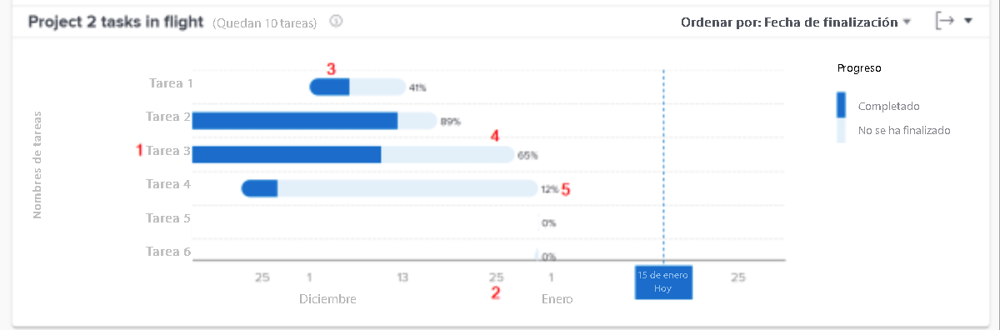

# Revise las tareas grupales

Este vídeo contiene información sobre:

* Cómo acceder a las Tareas en el gráfico de grupo
* Cómo ver rápidamente qué tareas no se han completado en un proyecto

>[!VIDEO](https://video.tv.adobe.com/v/335052/?quality=12&learn=on)

## Datos de nivel de tarea

Las tareas en el gráfico de grupo le permite explorar en profundidad las tareas de un proyecto específico para ver el volumen de trabajo completado de cada tarea activa y el grado de cumplimiento de la programación. El gráfico le permite comprender qué tareas de un proyecto deben completarse y cuál es el porcentaje de finalización.

Esta información puede ayudarle a determinar lo siguiente:

* En qué está trabajando la gente.
* Qué tareas podrían estar poniendo en riesgo un proyecto.
* Cuánto falta para completar una tarea.
* Con quién debe hablar acerca de una tarea específica.

En el gráfico, puede ver lo siguiente:

1. Nombres de las tareas a la izquierda.
1. Fechas en la parte inferior.
1. El color azul oscuro de una barra de tareas indica la cantidad de trabajo completado para una tarea.
1. El color azul claro de una barra de tareas indica la cantidad de trabajo que debe completarse para una tarea.
1. El número a la derecha de una barra de tareas muestra el porcentaje de finalización.
