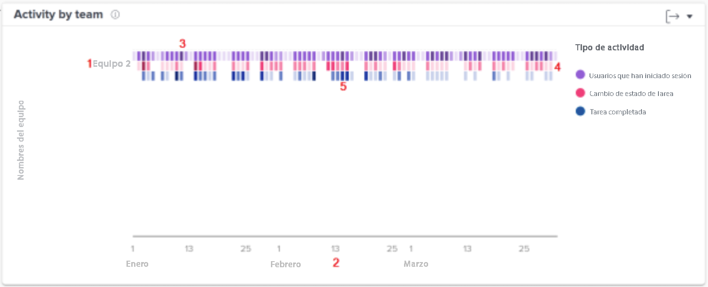

# Comprender la actividad por gráfico de equipos

El gráfico Actividad por equipos le permite comprender cómo los equipos locales de su organización invierten el tiempo en Workfront. Los usuarios de Workfront pueden estar en varios equipos, pero solo pueden estar en uno local. Los equipos utilizados en los gráficos de personas están formados solamente por aquellos usuarios que tienen a ese equipo designado como el local.

Las actividades (usuarios que iniciaron sesión, cambios en el estado de la tarea y tareas completadas) se muestran en diferentes colores para resumir estos eventos durante el período de tiempo filtrado.

Ver esta información le ayuda a determinar lo siguiente:

* Qué actividades están ocurriendo dentro de un equipo local y a qué ritmo.
* Qué equipos locales tienen demasiado trabajo o utilizan más el sistema.
* Si la distribución del trabajo es adecuada para el equipo local.

En el gráfico, puede ver lo siguiente:

1. Los nombres de los equipos locales a la izquierda.
1. Las fechas de la parte inferior proceden del intervalo de fechas seleccionado.
1. Las casillas moradas muestran que los usuarios asignados al proyecto han iniciado la sesión ese día, el tono más oscuro indica que un mayor número de usuarios han iniciado sesión.
1. Las casillas rosadas muestran que los usuarios han cambiado el estado de una tarea para el proyecto ese día, un tono más oscuro indica que ha cambiado un número mayor de estados de las tareas.
1. Las casillas azules muestran que los usuarios han completado una tarea para el proyecto, un tono más oscuro indica un mayor número de tareas completadas.

## Cómo navegar al gráfico

1. Haga clic en la pestaña [!UICONTROL Personas] del panel izquierdo.
1. Utilice la variable [!UICONTROL Filtro] para elegir uno o más equipos locales que examinar.
1. Verá que el gráfico de actividad por equipos aparece en la parte superior de los gráficos de personas.
