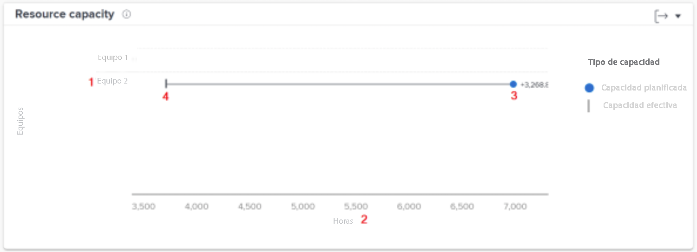

# Comprensión del gráfico de capacidad de recursos en [!UICONTROL Análisis mejorado]

El gráfico Capacidad de los Recursos muestra el número de horas planificadas asignadas a un equipo de inicio dentro del período de tiempo filtrado en comparación con el total de horas disponibles del equipo.

Esta comparación puede ayudarle a determinar si no asigna suficiente trabajo al equipo o si puede que estén experimentando agotamiento debido a una gran carga de trabajo. Haga clic en el nombre de un equipo y aparecerá un gráfico de capacidad del equipo en el que se mostrarán más detalles sobre la capacidad del equipo para el período de tiempo filtrado.

Ver esta información le ayuda a determinar lo siguiente:

* Si el equipo de inicio estaba sobreasignado o subasignado.
* Qué equipos de inicio están disponibles para trabajar.

En el gráfico, puede ver los siguientes detalles clave:

1. Los nombres de los equipos de inicio están a la izquierda.
1. Las horas están al otro lado del fondo. Este es el eje x del gráfico y se calcula según el rango de horas mostrado en los equipos anteriores.
1. El círculo muestra el número de horas planificadas asignadas al equipo de inicio.
1. La línea vertical muestra la cantidad total de horas disponibles para el equipo de inicio.

## Cómo navegar hasta el gráfico

1. Haga clic en [!UICONTROL People] en el panel izquierdo.
1. Utilice el [!UICONTROL Filtrar] para elegir uno o más equipos de inicio para examinar.
1. Verá el icono [!UICONTROL Capacidad de recursos] el gráfico aparece debajo del gráfico de actividad del equipo.

## Cómo utilizar el gráfico

Debe añadir filtros y seleccionar un intervalo de fechas para mostrar los datos en los gráficos de la [!UICONTROL Análisis mejorado] de Workfront. Si ha añadido filtros anteriormente, estos permanecerán activos hasta que los elimine.

En el gráfico Capacidad de los recursos, puede:

* Pase el ratón sobre la línea del equipo de inicio para ver cuántas horas están disponibles para programar, la cantidad de horas planificadas para que el equipo de inicio finalice y la cantidad total de horas trabajadas (etiquetadas como superiores, inferiores o en capacidad).
* Exporte los datos del gráfico con el botón export situado en la esquina superior derecha del gráfico.
* Haga clic en el nombre del equipo de inicio para abrir el gráfico de capacidad del equipo. Al ampliar a un periodo de tiempo menor el gráfico de capacidad del equipo, se actualizan los datos que aparecen en el gráfico de capacidad del recurso.
