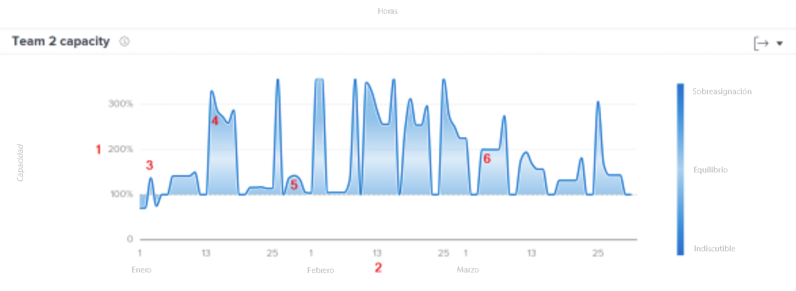
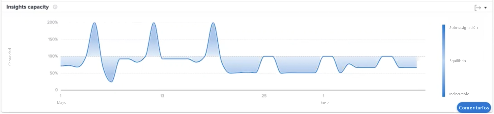

# Comprender la capacidad del equipo en [!UICONTROL Análisis mejorado]

El gráfico de capacidad del equipo muestra cuándo un equipo de origen estaba sobreasignado o subasignado. El gráfico muestra el volumen de trabajo asignado al equipo de casa en un día determinado y asigna un color azul más oscuro cuando se aproxima a la explosión o no se está cuestionando. Un color más claro y transparente indica que la carga de trabajo está más equilibrada.

Ver esta información le ayuda a determinar:

* Cuando el equipo de origen estaba sobreasignado o subasignado.
* Si el equipo de origen está sobreasignado o subasignado diariamente.
* La consistencia de la carga de trabajo de un equipo doméstico es diaria.
* Si está creando problemas de capacidad con un nuevo trabajo.

En el gráfico, puede ver:

1. El porcentaje de la capacidad del equipo de casa está a la izquierda.
1. Las fechas de la parte inferior proceden del intervalo de fechas seleccionado.
1. El color de relleno azul más oscuro indica que el equipo de casa está experimentando una explosión (4) o no está sujeto a desafío.
1. El azul más claro o más transparente indica que la carga de trabajo del equipo doméstico está equilibrada

## Cómo navegar al gráfico

1. Haga clic en el [!UICONTROL People] en el panel izquierdo.
1. Utilice la variable [!UICONTROL Filtro] para elegir un equipo de Inicio que examinar.
1. Verá que el gráfico de capacidad del equipo aparece debajo del [!UICONTROL Capacidad de los recursos] gráfico.

## Cómo utilizar el gráfico

Para mostrar datos en los gráficos de la sección Personas del área Analytics, debe agregar filtros y seleccionar un intervalo de fechas. Si ha añadido filtros anteriormente, estos se activan hasta que los elimine.

En el gráfico Capacidad del equipo, puede:

* Pase el ratón sobre un punto del gráfico para ver la línea de fecha.
* Pase el ratón por encima de un punto de la línea gráfica para ver las horas programadas y las horas programadas para la fecha determinada, así como el porcentaje de capacidad y si el equipo de origen ha terminado, se encuentra por debajo o en su capacidad en ese momento.
* Acerque las fechas haciendo clic y arrastrando el ratón sobre un punto determinado del proyecto. (Esta acción actualiza todos los demás gráficos para ampliar el mismo intervalo de fechas).
* Exporte los datos del gráfico con el botón de exportación situado en la esquina superior derecha del gráfico.
