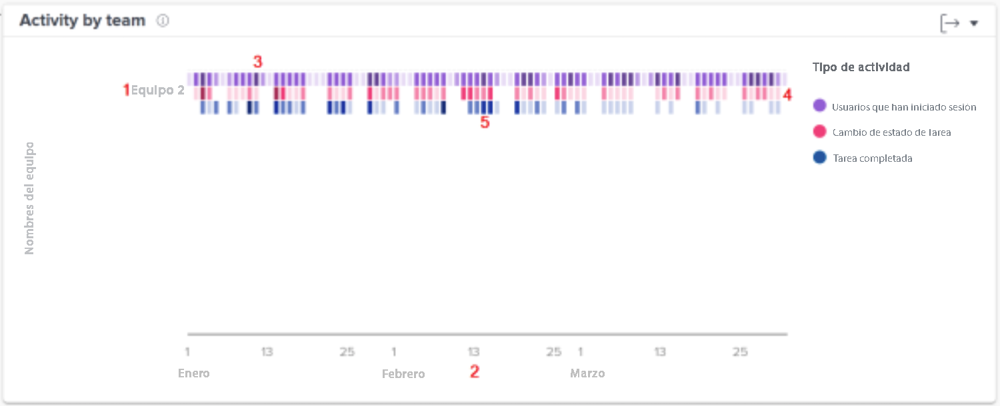

# Comprensión de los gráficos de trabajo y personas

Los gráficos de trabajo muestran la actividad desde la perspectiva del proyecto y la tarea, mientras que el gráfico Personas muestra la actividad desde la perspectiva de un equipo de inicio.

Seleccione el tipo de gráficos de Analytics que desea ver (Trabajo o Personas) en el menú del panel izquierdo.

## Gráficos de trabajo

![Una imagen de cómo encontrar la función [!UICONTROL Analytics] en [!DNL Workfront Classic]](assets/section-1-1.png)

Cuando vaya a los gráficos de trabajo, verá de forma predeterminada lo siguiente:

1. Estadísticas de KPI
1. Plan de grupo
1. Actividad del proyecto
1. Diagrama de árbol del proyecto (no se muestra arriba)

Los gráficos de grupo Evolución y Tareas aparecen cuando se profundiza en los datos.

* Haga clic en un proyecto en la vista Plan de grupo y debajo aparecerá un resumen.
* Haga clic en un proyecto en la vista Diagrama de árbol y debajo aparecerán una lista de desglose y una vista Tareas en curso.

## Gráfico de personas - Actividad por equipo

En el gráfico, puede ver lo siguiente:

1. Los nombres de los equipos locales a la izquierda.
1. Las fechas de la parte inferior proceden del intervalo de fechas seleccionado.
1. Las casillas moradas muestran que los usuarios asignados al proyecto han iniciado la sesión ese día, el tono más oscuro indica que un mayor número de usuarios han iniciado sesión.
1. Las casillas rosadas muestran que los usuarios han cambiado el estado de una tarea para el proyecto ese día, un tono más oscuro indica que ha cambiado un número mayor de estados de las tareas.
1. Las casillas azules muestran que los usuarios han completado una tarea para el proyecto, un tono más oscuro indica un mayor número de tareas completadas.

