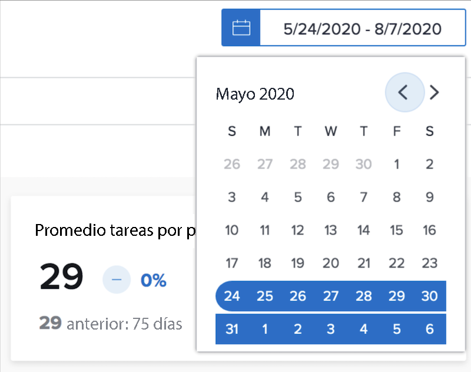
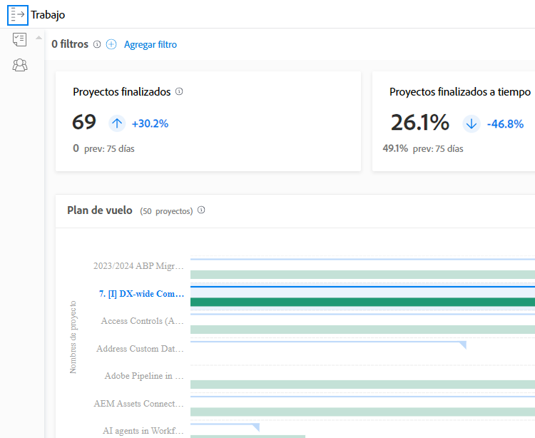

# Explicación de los intervalos de fechas y los marcos de tiempo

Al ver los gráficos en [!DNL Enhanced analytics], los intervalos de fechas se especifican utilizando el widget de calendario. Los intervalos de tiempo se crean dentro de un gráfico cuando hace clic y arrastra para definir una región específica, por lo que puede acercar y obtener una vista más detallada de la información durante ese intervalo de tiempo.

## Intervalos de fechas

Simplemente, haga clic en cualquier fecha del calendario para indicar una fecha del intervalo y luego haga clic en cualquier fecha para indicar el otro final del intervalo. Utilice las flechas de la parte superior del calendario para navegar a un mes diferente si las fechas de inicio y finalización no están en el mismo mes.

Los gráficos de [!DNL Analytics] muestran los datos de los últimos 60 días y los próximos 15 días de forma predeterminada. Puede seleccionar un nuevo intervalo de fechas y aplicarlo a todos los gráficos mientras utiliza [!DNL Analytics].

Cuando actualiza la página, se desplaza o cierra/inicia la sesión en Workfront, el intervalo de fechas se restablece al valor predeterminado.

## Períodos de tiempo

Haga clic y arrastre alrededor de una sección deseada de una cronología para crear un filtro de período de tiempo. Este período de tiempo ahora se aplica a todos los gráficos del área de trabajo y aparece junto a cualquier otro filtro de la barra de filtros. Para profundizar en un gráfico, haga clic y arrastre alrededor de las áreas para actualizar el período de tiempo. Para quitar el filtro, simplemente pase el ratón sobre él en la barra de filtros y haga clic en la X que aparece.

Cuando actualiza la página, desplácese o cierre la sesión en Workfront, el período de tiempo se elimina y el intervalo de fechas se restablece.

>[!NOTE]
>
>No puede utilizar esta opción de período de tiempo con los gráficos de árbol ni con la capacidad de recursos del proyecto.
