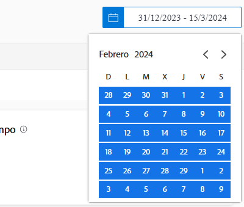

# Explicación de los intervalos de fechas y tiempos en [!UICONTROL Análisis mejorado]

Al ver el [!DNL Enhanced analytics] gráficos, los intervalos de fechas se especifican mediante el widget de calendario. Los marcos de tiempo se crean dentro de un gráfico cuando hace clic y arrastra para definir una región específica, de modo que puede aumentar y obtener una visión más detallada de la información durante ese marco de tiempo.

## Intervalos de fechas

Simplemente haga clic en cualquier fecha del calendario para indicar una fecha del intervalo y, a continuación, haga clic en cualquier fecha para indicar el otro extremo del intervalo. Utilice las flechas de la parte superior del calendario para desplazarse a un mes diferente si las fechas de inicio y finalización no son del mismo mes.

Los gráficos de [!DNL Analytics] mostrar los datos de los últimos 60 días y de los próximos 15 días de forma predeterminada. Puede seleccionar un nuevo intervalo de fechas y aplicarlo a todos los gráficos mientras utiliza [!DNL Analytics].

Al actualizar la página, salir o cerrar la sesión/iniciar sesión en Workfront, el intervalo de fechas se restablece al valor predeterminado.

## Periodos de tiempo

Haga clic y arrastre alrededor de la sección deseada de una cronología para crear un filtro de periodo de tiempo. Este periodo de tiempo ahora se aplica a todos los gráficos del área de Trabajo y aparece junto a cualquier otro filtro de la barra de filtros. Profundice en un gráfico haciendo clic y arrastrando alrededor de las áreas para actualizar el periodo de tiempo. Para eliminar el filtro de periodo de tiempo, simplemente pase el ratón sobre él en la barra de filtros y haga clic en la X que aparece.

Al actualizar la página, salir o cerrar la sesión de Workfront, el periodo de tiempo se elimina y se restablece el intervalo de fechas.

>[!NOTE]
>
>No puede utilizar esta opción de periodo de tiempo con los gráficos Diagrama de árbol del proyecto y Capacidad de los recursos.
