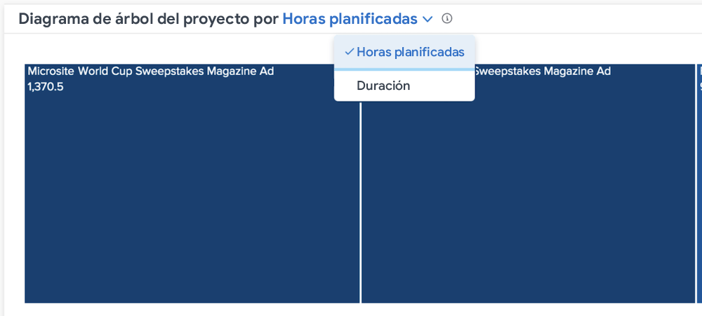

# Conozca las horas y vistas de duración programadas en [!UICONTROL Análisis mejorado]

En los gráficos de rectángulos Desglose y Proyecto , puede ver la información por horas o duración planificadas, según lo que considere más preciso para su entorno de Workfront.

El horario planificado es el predeterminado. Si cambia a la duración, esto se mantiene si se aleja de [!DNL Analytics] y volver y entre inicios de sesión de Workfront.

## ¿Qué significa el tamaño del cuadro y el color de sombreado?

Las cajas azules más pequeñas y más claras indican menos horas, mientras que las cajas más grandes y los tonos más oscuros de azul indican más horas en comparación. Para obtener más información, consulte [Comprender la visualización del diagrama de árbol del proyecto](https://experienceleague.adobe.com/docs/workfront/using/reporting/enhanced-analytics/project-treemap-overview.html?lang=en).
