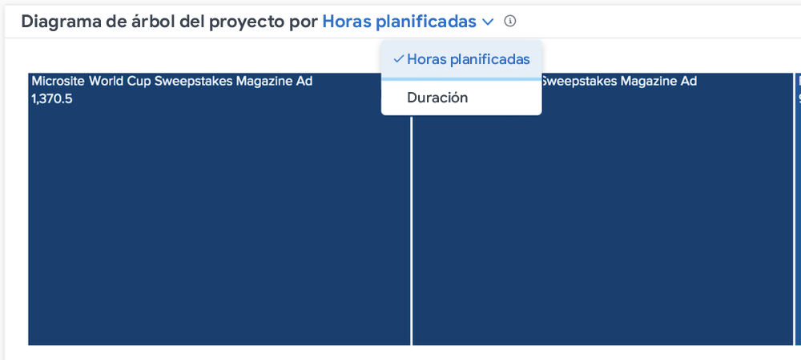

# Comprender las horas planificadas y las vistas de duración

En los gráficos de árbol Evolución y Proyecto, puede ver la información por horas planificadas o duración, según lo que considere más preciso para su entorno de Workfront.

Las horas planificadas son las predeterminadas. Si cambia a la duración, esto se mantiene si navega fuera de [!DNL Analytics] y vuelve y entre inicios de sesión de Workfront.

## ¿Qué significan el tamaño de la casilla y el color de sombreado?

Las casillas azules más pequeñas y claras indican menos horas, mientras que las casillas más grandes y de tono azul oscuro indican más horas en comparación. Para obtener más información, consulte [Comprender la visualización del gráfico de árbol del proyecto](https://experienceleague.adobe.com/docs/workfront/using/reporting/enhanced-analytics/project-treemap-overview.html?lang=es).
