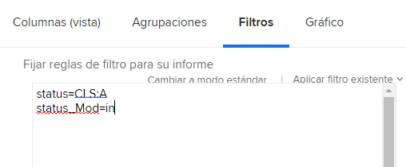

# Comprender el modo de texto básico de los filtros

En este vídeo, aprenderá:

* Qué modo de texto es
* Qué caso de camello es
* Algunos modos de texto &quot;Plug and Play&quot; básicos que se pueden usar en los filtros de informe

>[!VIDEO](https://video.tv.adobe.com/v/336820/?quality=12)

El siguiente modo de texto excluirá las tareas en las que el usuario ha marcado &quot;Listo con mi parte&quot;. Todo lo que tiene que hacer es crear un filtro de tareas, agregar cualquier regla de filtro que desee, luego cambiar al modo de texto y pegar el código siguiente después de cualquier modo de texto que vea en el filtro.

```
EXISTS:1:$$OBJCODE=ASSGN  
EXISTS:1:taskID=FIELD:ID  
EXISTS:1:status=DN  
EXISTS:1:status_Mod=notin  
EXISTS:1:assignedToID=$$USER.ID 
```

## Actividad: Preguntas sobre el modo de texto

1. ¿Cómo escribiría el caso de camello para el campo titulado &quot;Introducido por ID&quot;?
1. En un informe de problemas, cree un filtro para mostrar los problemas que se han marcado como cerrados pero que están pendientes de aprobación.

## Respuestas

1. El caso de camello para el campo &quot;Introducido por ID&quot; debe escribirse de esta manera: enteredByID
1. El modo de texto debería tener este aspecto en el filtro de informe de problemas:

   
