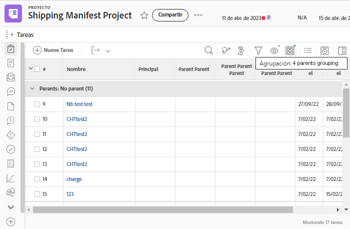
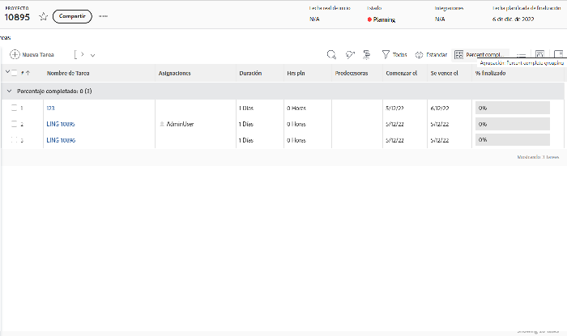
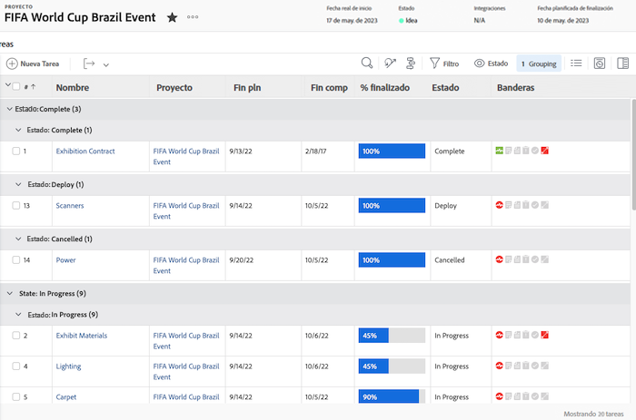
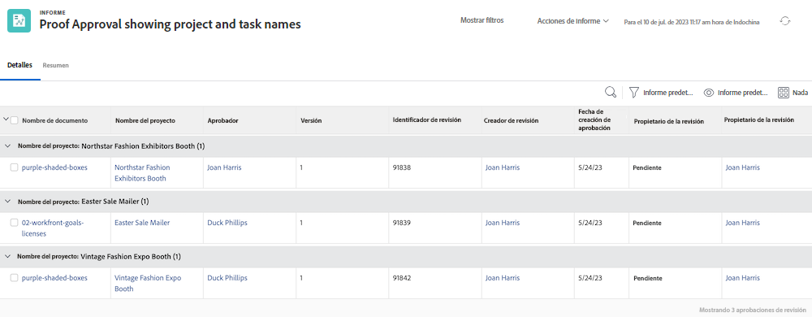
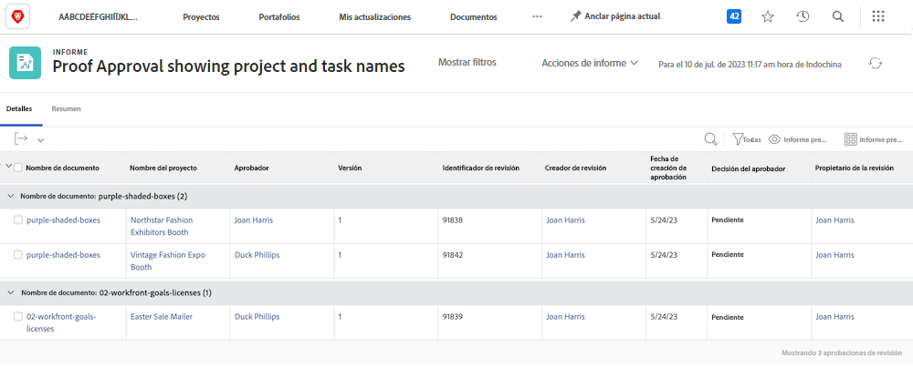

# Explorar el modo de texto básico para agrupaciones en Workfront

>[!PREREQUISITES]
>
>* [Comprensión de los elementos de creación de informes](https://experienceleague.adobe.com/docs/workfront-learn/tutorials-workfront/reporting/basic-reporting/create-a-task-report.html?lang=es)
>* [Información sobre los componentes del sistema de informes](https://experienceleague.adobe.com/docs/workfront-learn/tutorials-workfront/reporting/basic-reporting/reporting-components.html?lang=es)
>* [Crear una agrupación básica](https://experienceleague.adobe.com/docs/workfront-learn/tutorials-workfront/reporting/basic-reporting/create-a-basic-grouping.html?lang=es)


>[!TIP]
>
>* Para comprender mejor el modo de texto, le recomendamos que consulte el evento de seminario web grabado [Pregunte al experto: introducción a la creación de informes en modo de texto](https://experienceleague.adobe.com/en/docs/events/classics/reporting-and-dashboards/introduction-to-text-mode-reporting), que dura una hora.
>* Para obtener más información acerca del modo de texto, le recomendamos que consulte los tutoriales de [Creación de informes avanzada](https://experienceleague.adobe.com/docs/workfront-learn/tutorials-workfront/reporting/advanced-reporting/welcome-to-advanced-reporting.html?lang=es), que tienen una duración de cinco horas y media en total.
>* Haga clic aquí para acceder al [[!UICONTROL Explorador de la API]](https://developer.adobe.com/workfront/api-explorer/)

Este vídeo contiene información sobre:

* Qué es el modo de texto
* Qué son las palabras agrupadas en mayúsculas y minúsculas
* Algunos _bloques de código en modo texto_ que puede usar en sus agrupaciones de informes

>[!VIDEO](https://video.tv.adobe.com/v/3470784/?captions=spa&quality=12&learn=on&enablevpops=0)

## Actividades &quot;Comprender el modo de texto básico para agrupaciones&quot;

### Tarea: Agrupación de cuatro elementos principales

El siguiente modo de texto agrupa tareas basadas en hasta cuatro niveles de elementos principales y deja en blanco los que no existen.

```
textmode=true
group.0.name=Parents
group.0.valueexpression=CONCAT({parent}.{parent}.{parent}.{parent}.{name},IF(ISBLANK({parent}.{parent}.{parent}.{parent}.{name}),"",", "),{parent}.{parent}.{parent}.{name},IF(ISBLANK({parent}.{parent}.{parent}.{name}),"",", "),{parent}.{parent}.{name},IF(ISBLANK({parent}.{parent}.{name}),"",", "),IF(ISBLANK({parent}.{name}),"No parent",{parent}.{name}))
group.0.linkedname=parent
group.0.namekeyargkey.0=parent
group.0.namekeyargkey.1=name
group.0.valueformat=string
```




### Tarea: agrupación de porcentaje completado

El siguiente modo de texto agrupa las tareas en función de su porcentaje completado. Cuando se agrupen, las tareas se clasificarán en una de las siguientes categorías:

* 0 %
* De 1 a 25 %
* De 26 a 50 %
* De 51 a 75 %
* De 76 a 99 %
* 100 %

```
group.0.linkedname=direct
group.0.namekey=percentComplete
group.0.valueexpression=IF({percentComplete}<1,"0%",IF({percentComplete}<26,"1% to 25%",IF({percentComplete}<51,"26% to 50%",IF({percentComplete}<76,"51% to 75%",IF({percentComplete}<100,"76% to 99%",IF({percentComplete}=100,"100","***"))))))
group.0.valueformat=doubleAsString
textmode=true
```



### Tarea: statusEquatesWith, a continuación, por estado

El siguiente modo de texto agrupa las tareas por statusEquatesWith y, a continuación, por estado.

```
group.0.enumclass=com.attask.common.constants.TaskStatusEnum
group.0.enumtype=TASK
group.0.linkedname=direct
group.0.name=State
group.0.type=enum
group.0.valuefield=statusEquatesWith
group.0.valueformat=val
group.1.enumclass=com.attask.common.constants.TaskStatusEnum
group.1.enumtype=TASK
group.1.linkedname=direct
group.1.namekey=status
group.1.type=enum
group.1.valuefield=status
group.1.valueformat=val
textmode=true
```




### Aprobación de prueba: agrupar por nombre de proyecto

```
group.0.valueformat=HTML
group.0.valuefield=documentVersion:document:project:name
group.0.displayname=Project Name
```




### Aprobación de prueba: agrupar por nombre de documento

```
group.0.displayname=Document Name
group.0.valuefield=documentVersion:document:name
group.0.valueformat=HTML
```



