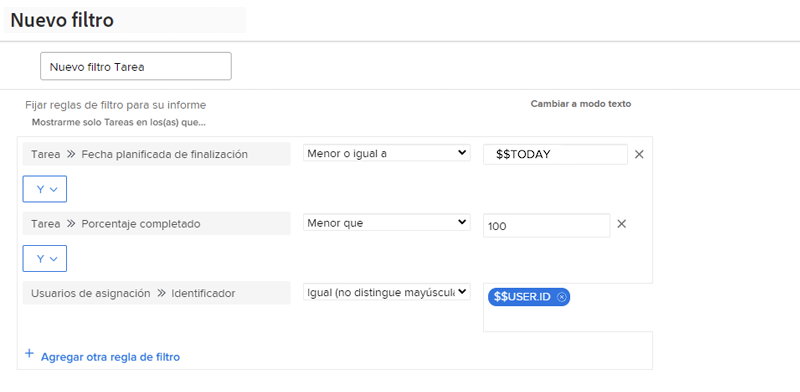

# Crear filtros con caracteres comodín basados en datos

Este vídeo contiene información sobre:

* Saber cuándo usar los caracteres comodín basados en datos
* Comprender la diferencia entre los dos comodines basados en fechas de Workfront
* Añadir un carácter comodín basado en datos a un filtro
* Crear una fecha personalizada utilizando caracteres comodín, atributos, operadores y modificadores
* Crear un intervalo de fechas personalizado con caracteres comodín

>[!VIDEO](https://video.tv.adobe.com/v/336812/?quality=12&learn=on&enablevpops=0)

## Actividades &quot;Crear filtros con comodines basados en fecha&quot;

### Preguntas sobre actividades

1. ¿Cómo crearía la regla de filtro si quisiera los problemas cuya fecha de vencimiento fuera ayer u hoy?
1. ¿Cómo crearía la regla de filtro para encontrar proyectos que vencieron la semana pasada?
1. Las siguientes reglas de filtro son parte de un informe de tareas que utiliza con regularidad. ¿Qué tipo de resultados obtendría de este informe?

### Respuestas

1. Filtre la fecha planificada de finalización del problema entre [!UICONTROL $$TODAY-1d] y [!UICONTROL $$TODAY].
1. Filtre la fecha planificada de finalización para el proyecto entre [!UICONTROL $$TODAYb-1w] y [!UICONTROL $$TODAYe-1w].
1. Este informe encuentra las tareas que se le han asignado y que aún no han finalizado (es decir, tienen un porcentaje completado inferior a 100) y que han vencido o que vencen en el día de hoy. La regla de filtro para la fecha planificada de finalización de las tareas indica que se deben ver las tareas que tienen una fecha de vencimiento igual o anterior a la fecha actual.
