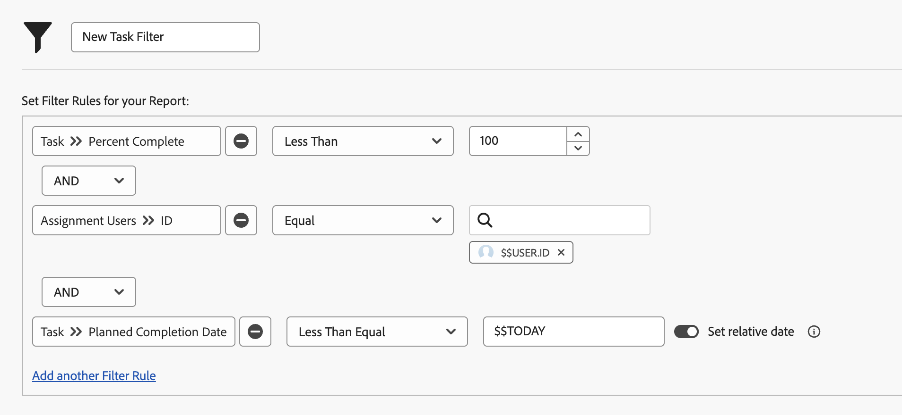

# Creación de filtros con comodines basados en fecha

En este vídeo, aprenderá a hacer lo siguiente:

* Saber cuándo usar comodines basados en fecha
* Comprender la diferencia entre los dos comodines basados en fechas de Workfront
* Adición de un comodín basado en la fecha a un filtro
* Crear una fecha personalizada con caracteres comodín, atributos, operadores y modificadores
* Crear un intervalo de fechas personalizado con caracteres comodín

>[!VIDEO](https://video.tv.adobe.com/v/336812/?quality=12&learn=on)

## Preguntas de actividad

1. ¿Cómo crearía la regla de filtro si desea problemas que tengan una fecha de vencimiento de ayer o hoy?
1. ¿Cómo crearía la regla de filtro para encontrar los proyectos con vencimiento la semana pasada?
1. Las siguientes reglas de filtrado forman parte de un informe de tareas que se utiliza con regularidad. ¿Qué tipo de resultados obtendría de este informe?

## Respuestas

1. Filtrar por la fecha planificada de finalización del problema entre [!UICONTROL $$TODAY-1d] y [!UICONTROL $$TODAY].
1. Filtrar por la fecha planificada de finalización del proyecto entre [!UICONTROL $$TODAYb-1w] y [!UICONTROL $$TODAYe-1w].
1. Este informe encuentra las tareas que se le han asignado y que aún no han finalizado (es decir, que tienen un porcentaje completado inferior a 100) y que han vencido o que vencen hoy. La regla de filtro para la fecha planificada de finalización de las tareas indica que se comprueben las tareas que tienen una fecha de vencimiento igual o anterior a la fecha actual.
