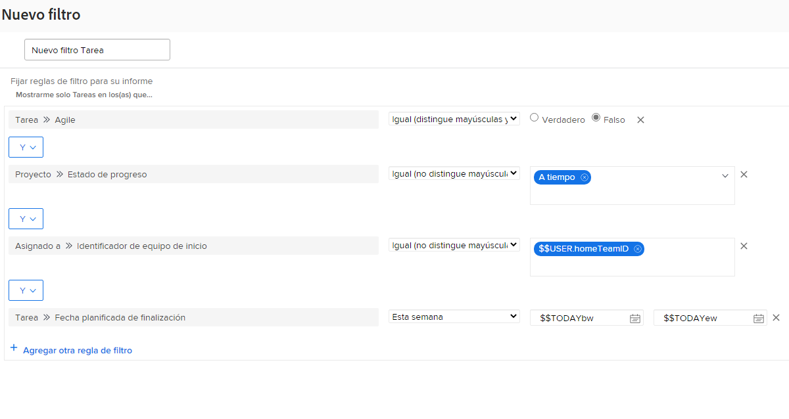

# Crear filtros con caracteres comodín basados en el usuario

Este vídeo contiene información sobre:

* Comprender por qué es necesario utilizar caracteres comodín
* Genere un filtro con caracteres comodín basado en el usuario

>[!VIDEO](https://video.tv.adobe.com/v/336810/?quality=12&learn=on&enablevpops)

>[!TIP]
>
>Utilice el nombre y la fuente del campo de asignación Usuarios >> ID al crear filtros que miren la información de asignación de tareas o problemas.  Esta opción busca todos los usuarios asignados a la tarea o al problema, no solo el “propietario” o el usuario asignado principal.

>[!TIP]
>
>Utilice $$USER.ID (en lugar de su nombre) incluso cuando cree filtros para usted mismo. De esta manera, si alguien ve un filtro que se esté ejecutando y se lea “compartir eso conmigo”, el filtro ya está configurado para que cada persona que lo utilice vea su propia información.

>[!TIP]
>
>Siempre debe utilizar el calificador de filtro Igual al utilizar caracteres comodín basados en el usuario.

## Actividad

Esta semana tiene un poco de tiempo adicional, por lo que desea ver si hay alguien en su equipo que pueda utilizar algún tipo de asistencia con sus asignaciones. Cree un filtro de tareas para encontrar las que venzan esa semana y no se hayan completado.

## Respuesta

Usted es impresionante al ayudar a sus compañeros de equipo. Con el filtro configurado como la imagen siguiente, encontrará tareas como las siguientes:

* que no se hayan completado (lo que significa que no tengan un estado de [!UICONTROL Completo] o igual a [!UICONTROL Completo]);
* que estén en proyectos con un estado [!UICONTROL Actual] (después de todo, no desea encontrar tareas para proyectos que aún no se han iniciado);
* que se asignen a alguien del equipo local, tal como se define en la configuración del equipo de Workfront;
* o que tengan una fecha de finalización en algún momento de esta semana (esta regla usaba el filtro de fechas generado previamente para definir “esta semana”).

Es posible que necesite añadir algunos filtros adicionales si necesita limitar la lista un poco más. Por ejemplo, puede que desee agregar una regla de filtro que observe un programa o portafolio específico en el que su equipo trabaja.
