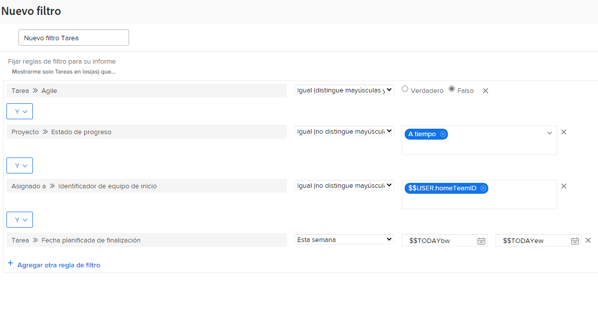

# Crear filtros con caracteres comodín basados en el usuario

Este vídeo contiene información sobre:

* Comprender por qué es necesario utilizar caracteres comodín
* Genere un filtro con caracteres comodín basado en el usuario

>[!VIDEO](https://video.tv.adobe.com/v/3412653/?captions=spa&quality=12&learn=on&enablevpops=0)

>[!TIP]
>
>Utilice el nombre y la fuente del campo de asignación Usuarios >> ID al crear filtros que miren la información de asignación de tareas o problemas.  Esta opción busca todos los usuarios asignados a la tarea o al problema, no solo el &quot;propietario&quot; o el usuario asignado principal.

>[!TIP]
>
>Utilice $$USER.ID (en lugar de su nombre) incluso cuando cree filtros para usted mismo. De este modo, si alguien ve un filtro que está ejecutando y dice &quot;Compártalo conmigo&quot;, el filtro ya está configurado para que cada persona que lo utilice vea su propia información.

>[!TIP]
>
>Siempre debe utilizar el calificador de filtro Igual al utilizar caracteres comodín basados en el usuario.

## Actividades &quot;Crear filtros con comodines basados en usuarios&quot;

### Actividad 1

Esta semana tiene un poco de tiempo extra, así que quiere ver si hay alguien en su equipo que pueda necesitar ayuda con sus tareas. Cree un filtro de tareas para buscar las tareas asignadas a su equipo de inicio que vencen esta semana y que aún no se han completado.

### Respuesta 1

¡Eres increíble por ayudar a tus compañeros de equipo! Con el filtro configurado como en la imagen siguiente, encontrará tareas:

* Que no se hayan completado (lo que significa que no tienen un estado [!UICONTROL Completo] o que equivale a [!UICONTROL Completo]);
* Que se encuentran en proyectos con un estado [!UICONTROL Actual] (después de todo, no desea encontrar tareas para proyectos que aún no se hayan iniciado);
* que se asignen a alguien del equipo local, tal como se define en la configuración del equipo de Workfront;
* Y que tienen una fecha de finalización en algún momento de esta semana (esta regla utilizó el filtro de fecha generado previamente para definir &quot;esta semana&quot;).

Es posible que necesite añadir algunos filtros adicionales si necesita limitar la lista un poco más. Por ejemplo, puede que desee agregar una regla de filtro que observe un programa o portafolio específico en el que su equipo trabaja.
