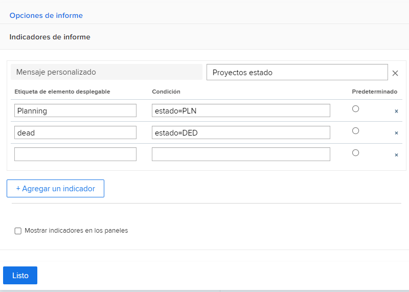
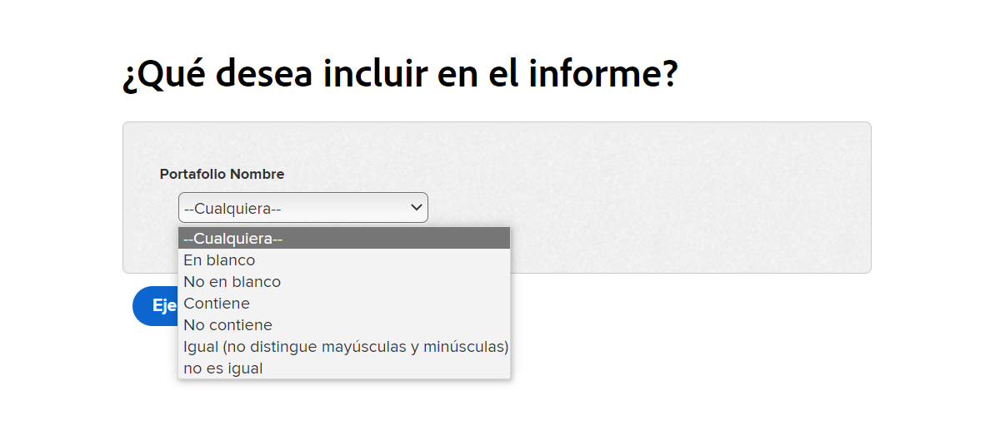
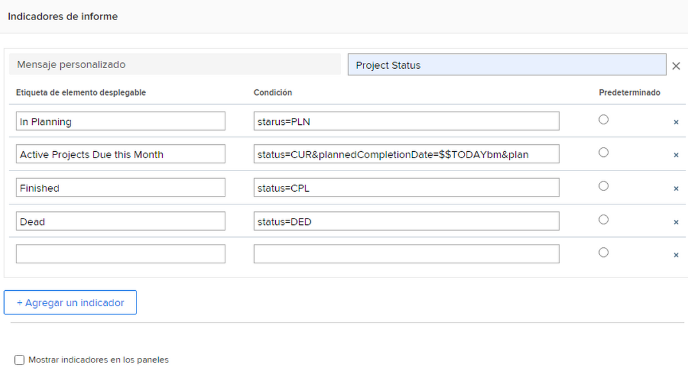

# Crear mensajes personalizados

Este vídeo contiene información sobre:

* Qué es un mensaje personalizado
* Cómo crear una solicitud personalizada mediante el modo de texto
* Algunos ejemplos que se pueden usar en los informes

>[!VIDEO](https://video.tv.adobe.com/v/336822/?quality=12&amp;learn=on&amp;enablevpops=0

## Actividades &quot;Crear indicadores personalizados&quot;


### Actividad: Crear mensajes personalizados

1. Cree un mensaje personalizado que muestre los siguientes estados de proyecto en el menú desplegable de solicitudes:
   * Planificación
   * Al día
   * Finalizado
   * Inactivo
1. Modifique la solicitud para mostrar los proyectos actuales que vencen este mes.

### Respuestas

1. Las indicaciones personalizadas deben tener un aspecto similar al siguiente y el siguiente modo de texto:

   

   Una vez guardado el mensaje personalizado, el menú desplegable del mensaje debería tener este aspecto:

1. El modo de texto en el mensaje personalizado debería tener este aspecto:



```
   status=CUR&plannedCompletionDate=$$TODAYbm&plannedCompletionDate_Mod=between&plannedCompletionDate_Range=$$TODAYem 
```

Y la etiqueta desplegable para las solicitudes activas debe actualizarse para reflejar el cambio en el código de esta manera:


