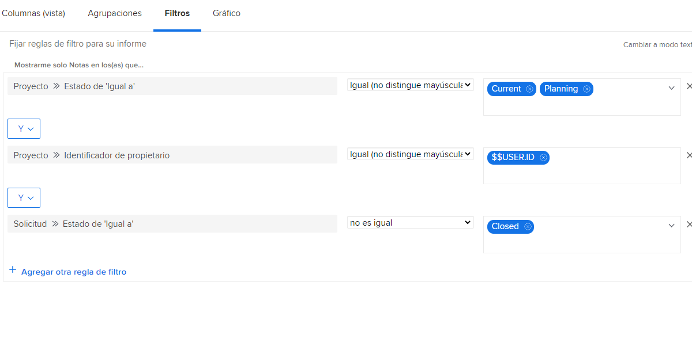
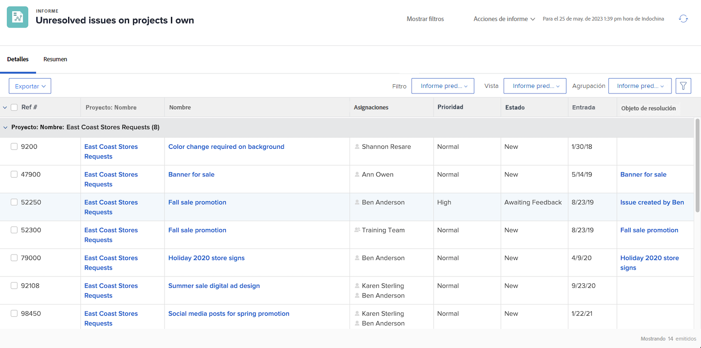

# Explicación de los filtros de problema integrados

En este vídeo, aprenderá lo siguiente:

* Revise los filtros de problema integrados para ver cómo se crean
* Obtenga información sobre algunos elementos útiles de creación de informes de problemas
* Información sobre cómo crear su propio filtro de problemas

>[!VIDEO](https://video.tv.adobe.com/v/336819/?quality=12&learn=on)

## Actividad: creación de un informe de problemas

Desea ver todos los problemas que aún deben resolverse en todos los proyectos activos que posee, incluidos los problemas con un objeto de resolución. Cree un informe de problemas y asígnele el nombre “Problemas no resueltos en proyectos que tengo”.

## Respuesta

Este es el aspecto que debería tener el filtro:

En el filtro integrado “Mis problemas abiertos”, una de las reglas de filtro excluía cualquier problema en el que hubiera un objeto de resolución. El motivo es que no tiene que preocuparse por estos problemas. Alguien ya ha creado un proyecto, una tarea o un problema que los resolverá, así que ¿de qué preocuparse? Pero todavía no están resueltos, y en nuestro ejemplo los incluimos para facilitar su identificación y verificación.

Para ello, debe añadir una columna en la pestaña de vista para “Problema >> Objeto de resolución”. Muestra el nombre del objeto de resolución, si hay uno, si es un proyecto, una tarea o un problema. Al hacer clic en el nombre se accede al objeto de resolución.

Es posible que desee agrupar la lista en función del nombre del proyecto.

Este es el aspecto que debería tener el informe:

