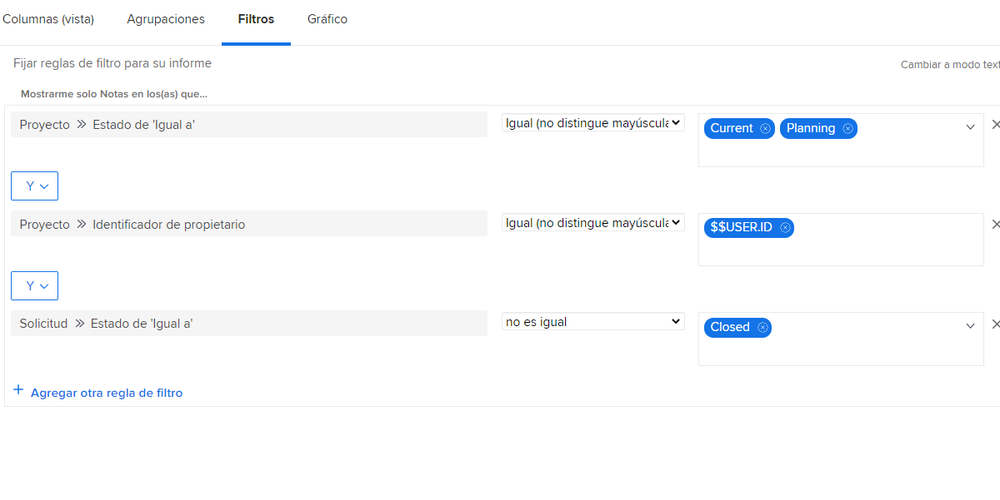
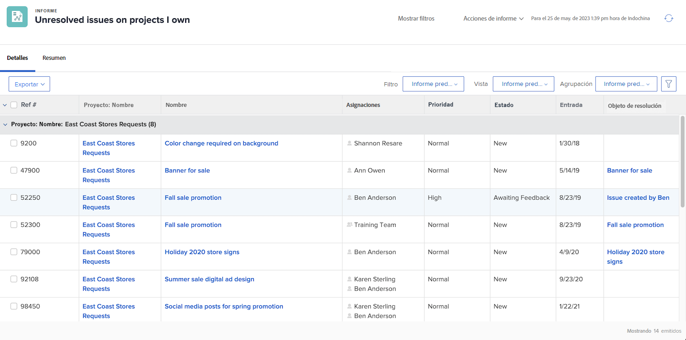

# Exploración de los filtros de problemas integrados

En este vídeo, aprenderá lo siguiente:

* Revise los filtros de problema integrados para ver cómo se crean
* Obtenga información sobre algunos elementos útiles de creación de informes de problemas
* Información sobre cómo crear su propio filtro de problemas

>[!VIDEO](https://video.tv.adobe.com/v/336819/?quality=12&learn=on&enablevpops=0)

## Actividades de &quot;Comprensión de los filtros de problemas integrados&quot;

### Actividad: creación de un informe de problemas

Desea ver todos los problemas que aún deben resolverse en todos los proyectos activos que posee, incluidos los problemas con un objeto de resolución. Cree un informe de problemas y asígnele el nombre &quot;Problemas no resueltos en proyectos de mi propiedad&quot;.

### Respuesta

Este es el aspecto que debería tener el filtro:

En el filtro integrado &quot;Mis problemas abiertos&quot;, una de las reglas de filtro excluía cualquier problema en el que hubiera un objeto de resolución. El razonamiento detrás de esto es que no tienes que preocuparte por esos temas. Alguien ya ha creado un proyecto, tarea o problema que los resolverá. ¿Qué hay de qué preocuparse? Pero aún no se han resuelto, y en nuestro ejemplo los incluimos para que sean fáciles de identificar y comprobar cómo lo están haciendo.

Para ello, debe agregar una columna en la pestaña Ver para &quot;Problema >> Objeto de resolución&quot;. Muestra el nombre del objeto de resolución, si hay uno, si es un proyecto, una tarea o un problema. Al hacer clic en el nombre se accede al objeto de resolución.

Es posible que desee agrupar la lista en función del nombre del proyecto.

Este es el aspecto que debería tener el informe:

