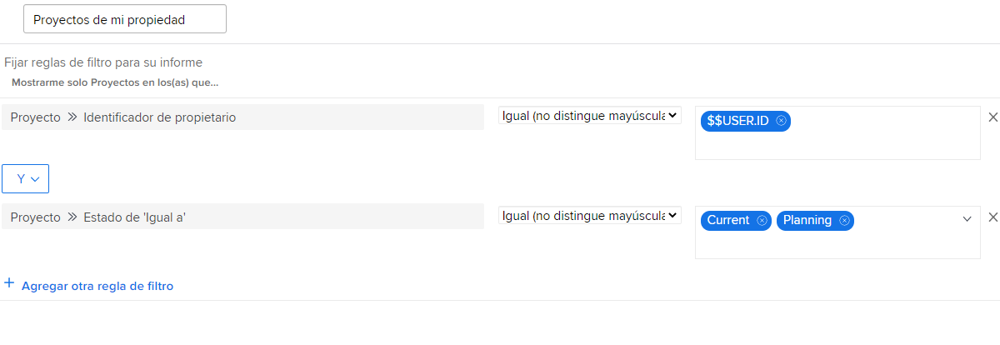

# Exploración de filtros de proyecto integrados

Este vídeo contiene información sobre:

* Revise los filtros de proyecto integrados para ver cómo se crean
* Cree su propio filtro de proyecto con lo que ha aprendido

>[!VIDEO](https://video.tv.adobe.com/v/3412665/?captions=spa&quality=12&learn=on&enablevpops=0)

## Actividades de &quot;Comprensión de los filtros de proyecto integrados&quot;

### Actividad: Crear un filtro de proyecto

Desea ver todos los proyectos activos que posee, donde “activo” significa que el estado del proyecto equivale a Planificado o Actual. En el área Proyectos, cree un filtro de proyecto denominado “Proyectos activos que tengo”.

### Respuesta

El filtro debería tener este aspecto:

Puede incluir reglas de filtro adicionales, como buscar proyectos en un determinado programa o portafolio. Para ello, Workfront recomienda cambiar el nombre del filtro por otro que sea apropiadamente descriptivo, como “Proyectos activos que tengo en el portafolios de marketing”.
