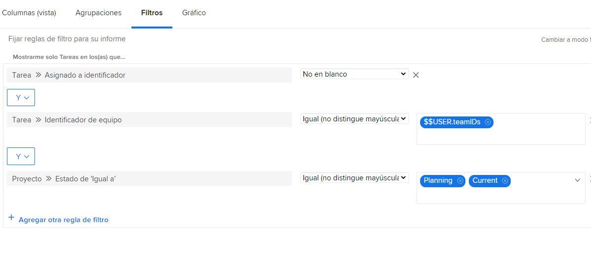
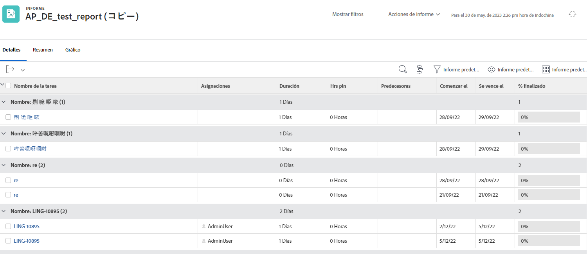

# Explicación de los filtros de tareas integrados

En este vídeo, aprenderá lo siguiente:

* Revise los filtros de tareas integrados para ver cómo se crean
* Obtenga información sobre algunos elementos útiles de informes de tareas
* Aprenda a crear su propio filtro de tareas

>[!VIDEO](https://video.tv.adobe.com/v/3412671/?quality=12&learn=on&captions=spa)

## Actividades de &quot;Comprensión de los filtros de tareas integrados&quot;

### Actividad: Crear un informe de tareas

Desea asegurarse de que está al tanto de las tareas asignadas a uno de sus equipos y que nadie ha aceptado trabajar en ellas todavía. Cree un informe de tareas llamado &quot;Tareas no asignadas en cualquiera de mis equipos&quot;.

### Respuesta

Este es el aspecto que debería tener el filtro:

Configure la vista de columna para incluir los campos que le interesan o que desea editar en línea. Por ejemplo, podría incluir una columna Asignaciones para asignar un miembro del equipo a una tarea directamente desde el informe.

Puede que desee agrupar la lista en función del nombre del equipo asignado a cada tarea.

Este es el aspecto que podría tener el informe:

