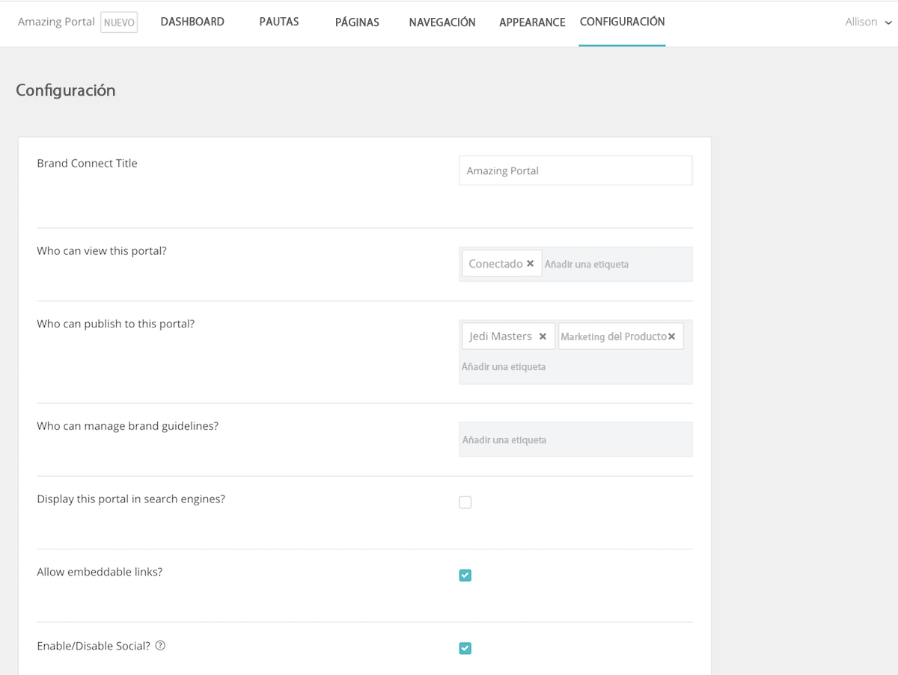

# Establezca la configuración del sistema en [!UICONTROL Brand Connect]

Los ajustes de [!UICONTROL Brand Connect] controlan quién puede ver el portal, quién puede publicar contenido y administrar las directrices de marca.

Para acceder a la configuración, inicie sesión en [!UICONTROL DAM de Workfront].

1. Haga clic en el **icono de configuración** en la barra de navegación y seleccione **[!UICONTROL Brand Connect]**. O haga clic en **[!UICONTROL Marcas]** en la barra de navegación.
1. A continuación, haga clic en la opción **[!UICONTROL Editar]** en la esquina superior derecha del panel [!UICONTROL Brand Connect]. Si su organización tiene varios [!UICONTROL Brand Connect], asegúrese de que está editando el correcto.

Hable con su consultor de [!UICONTROL Workfront] si tiene preguntas sobre cualquiera de estas configuraciones.

* **[!UICONTROL Brand Connect] Título**: asigne un nombre a [!UICONTROL Brand Connect] (o cambie el nombre).
* **¿Quién puede ver este portal?** Establezca los grupos que pueden ver [!UICONTROL Brand Connect]. Por ejemplo, si agrega el grupo que ha [!UICONTROL iniciado sesión], todos los usuarios que iniciaron sesión pueden ver el portal. Sin embargo, los permisos de carpeta siguen aplicándose, por lo que aunque un usuario pueda ver el portal, no podrá acceder a los recursos, a menos que al grupo que ha [!UICONTROL iniciado sesión] se le otorguen permisos para la carpeta.
* **¿Quién puede publicar en este portal?**: establezca los grupos que pueden publicar recursos en [!UICONTROL Brand Connect]. Esos serán grupos colaboradores. Solo pueden publicar elementos a los que tengan acceso.
* **¿Quién puede administrar las directrices de marca?**: establezca los grupos que pueden administrar las directrices de marca. La administración de las directrices no se limita a los usuarios administradores. Puede establecer un grupo de colaboradores para editar las directrices.
* **¿Mostrar este portal en motores de búsqueda?**: ¿Desea que se muestre la URL de [!UICONTROL Brand Connect] cuando la gente realice búsquedas en internet?
* **¿Permitir vínculos incrustables?**: ¿Los vínculos incrustables pueden provenir de [!UICONTROL Brand Connect]? Esto agrega el panel [!UICONTROL Obtener vínculos] al menú [!UICONTROL Compartir] que proporciona vínculos incrustables para el recurso.
* **¿Habilitar/deshabilitar Social?**: si Social está habilitado (marque la casilla), los usuarios pueden indicar que les gustan los recursos y realizar comentarios sobre ellos.
* **¿Desea habilitar/deshabilitar la descarga y ver el recuento?**: cuando está activado, los usuarios pueden ver cuántas veces se ha descargado un recurso y cuántos comentarios tiene.
* **Ocultar facetas inicialmente**: oculte los filtros de búsqueda de metadatos que aparecen en el panel izquierdo de la página [!UICONTROL Recursos].
* **Etiqueta Lightbox**: seleccione una etiqueta para [!UICONTROL Lightboxes] — [!UICONTROL Lightbox], [!UICONTROL Colección], [!UICONTROL Favoritos] o [!UICONTROL Favoritos].
