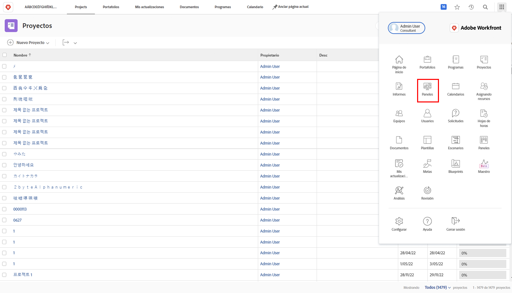
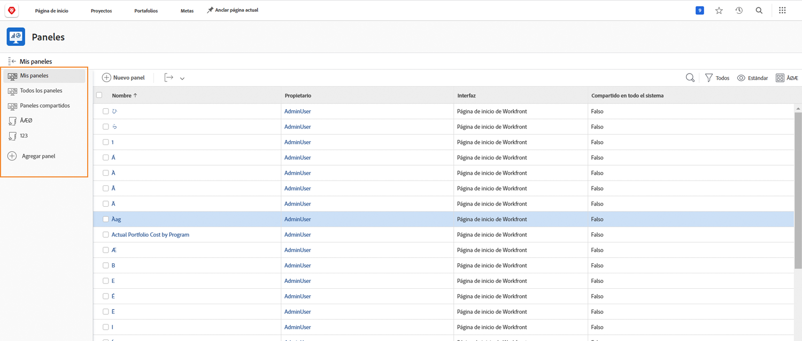
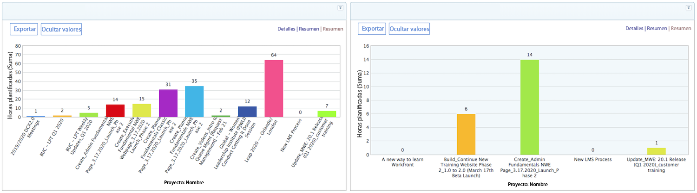
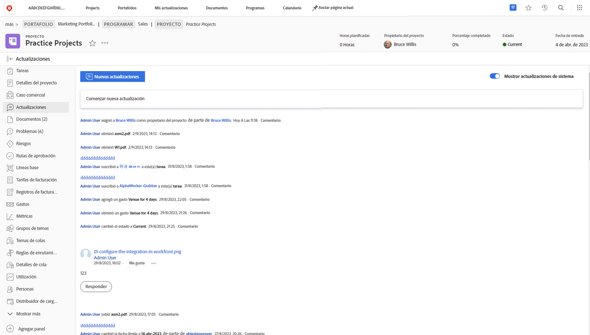
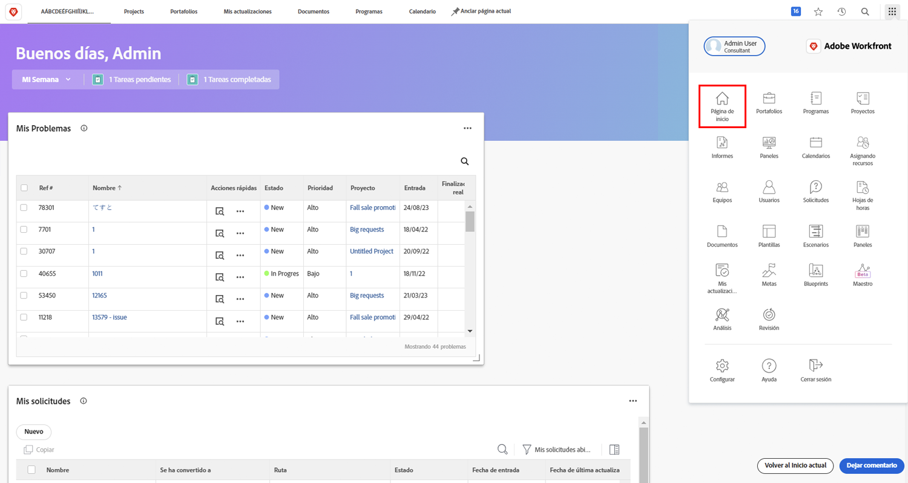

# Workfront para ejecutivos

Descubra cómo Workfront puede ayudarle a administrar el trabajo en su organización.

Como ejecutivo, Adobe Workfront puede ayudarle en lo siguiente:

* Mantenerle informado acerca del progreso del trabajo que le preocupa a través de **informes y paneles**
* Ofrecerle una forma sencilla de **comunicarse con las partes interesadas del proyecto mediante actualizaciones**
* Brindarle una forma sencilla de **efectuar una solicitud de trabajo**
* Proporcionarle una forma fácil de ver **elementos que esperan su aprobación**

## Informes y paneles

### Informes

Los informes de Workfront son la clave para tomar mejores decisiones de manera más rápida. Puede verlos en cualquier parte a la que vaya: en el área de proyectos, en el área de personas o en la página de aterrizaje de la tarea.

Los líderes y ejecutivos pueden navegar hasta el área del informe para ver informes personalizados con información específica. Para aumentar la visibilidad de los informes más importantes, Workfront utiliza paneles.

### Paneles

Al utilizar un panel, los líderes pueden ver y explorar rápidamente cualquier parte del trabajo en el que está trabajando su organización. El panel es simplemente una colección de informes que proporcionan información que los líderes pueden necesitar ver de forma regular. Los paneles son totalmente personalizables, de modo que cualquier usuario que utilice Workfront pueda ver el trabajo que le importe.

Haga clic en Paneles en el icono de menú Principal en la esquina superior derecha para acceder al área Paneles.

Los líderes pueden acceder a los distintos paneles disponibles desde el panel de navegación izquierdo.

* **Todos los Paneles**: muestra los paneles que usted y otros usuarios han creado y a los que tienen permisos para ver al menos.
* **Mis paneles**: muestra los paneles que ha creado.
* **Paneles compartidos**: muestra los paneles que otros usuarios han creado y compartido con usted.

Con un panel, los líderes son capaces de revisar cosas como los “Costes, ingresos y presupuestos”, para los proyectos importantes y problemas abiertos con los que sus equipos están lidiando. También pueden ver proyectos que están en riesgo, así como una lista de elementos que necesitan aprobación ejecutiva.

Los informes de Workfront pueden mejorar la rendición de cuentas de sus empleados. La clave para aprovechar los informes es establecer un flujo de trabajo claro para la forma en que su organización los utiliza. Asegúrese de que todos tengan una idea clara de qué informes se utilizan para medir el éxito.

Ejemplo de informes en un panel de Workfront

## Comunicación con las partes interesadas del proyecto mediante actualizaciones

Comuníquese con el equipo del proyecto dentro del propio proyecto para que todas las comunicaciones sean fácilmente accesibles.

## Realizar una solicitud

En muchas organizaciones, el primer paso para iniciar un nuevo proyecto, desarrollar un nuevo producto o crear un envío es realizar una solicitud en Workfront. Puede seguir el progreso de la solicitud y proporcionar información adicional cuando sea necesario.

Este vídeo contiene información sobre:

* Navegar al área de la solicitud
* Realizar una solicitud
* Ver las solicitudes enviadas

>[!VIDEO](https://video.tv.adobe.com/v/336092/?quality=12&learn=on)

## Elementos que esperan su aprobación

En [!UICONTROL Inicio] puede encontrar fácilmente artículos que esperan su aprobación.

