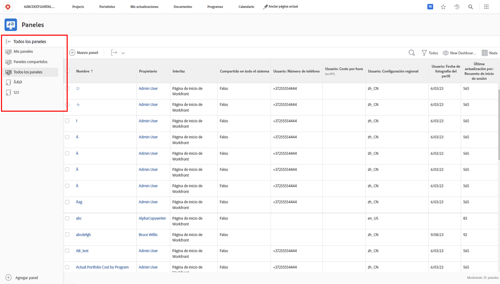

# Workfront para ejecutivos

## Informes y paneles

### Informes

Los informes de Workfront son la columna vertebral para tomar mejores decisiones con mayor rapidez. Puede verlas dondequiera que vaya: en el área de proyectos, en el área de personas o en una página de aterrizaje de tareas.

Los líderes y ejecutivos pueden desplazarse al área de informes para ver informes personalizados con información específica. Para aumentar la visibilidad de los informes más importantes, Workfront utiliza paneles.

### Paneles

Al utilizar un tablero, los líderes pueden ver y explorar en profundidad rápidamente cualquier parte del trabajo en el que esté trabajando su organización actualmente.El tablero es simplemente una recopilación de informes que proporcionan información que los líderes pueden necesitar ver de forma regular. Los paneles son completamente personalizables, de modo que cualquier persona que utilice Workfront pueda ver el trabajo que le importa.

Haga clic en Paneles en el icono del menú Principal en la esquina superior derecha para acceder al área de Paneles.

Los líderes pueden acceder a los diferentes paneles disponibles desde el panel de navegación izquierdo.

* **Todos los paneles**: Muestra los tableros que usted u otros usuarios han creado y para los que tiene permisos de al menos Ver.
* **Mis paneles**: Muestra los paneles que ha creado.
* **Paneles compartidos**: Muestra los paneles que han creado otros usuarios y que se han compartido con usted.

Con un tablero, los líderes pueden revisar cosas como &quot;Costos, Ingresos y Presupuestos&quot;, para proyectos importantes y problemas pendientes con los que sus equipos están lidiando. También pueden ver proyectos en riesgo, así como una lista de elementos que necesitan aprobación ejecutiva.

Los informes de Workfront pueden ayudar a mejorar la rendición de cuentas de sus empleados. La clave para aprovechar los informes es establecer un flujo de trabajo claro para la forma en que su organización los utiliza. Asegúrese de que todos tengan una idea clara de qué informes se utilizan para medir el éxito.

Ejemplo de informes en un panel en Workfront

## Realizar una solicitud

En muchas organizaciones, el primer paso para iniciar un nuevo proyecto, desarrollar un nuevo producto o crear una entrega es realizar una solicitud en Workfront. Puede realizar un seguimiento del progreso de la solicitud y proporcionar información adicional cuando sea necesario.

En este vídeo, aprenderá a hacer lo siguiente:

* Vaya al área de solicitud
* Realizar una solicitud
* Ver las solicitudes enviadas

>[!VIDEO](https://video.tv.adobe.com/v/336092/?quality=12&learn=on)
