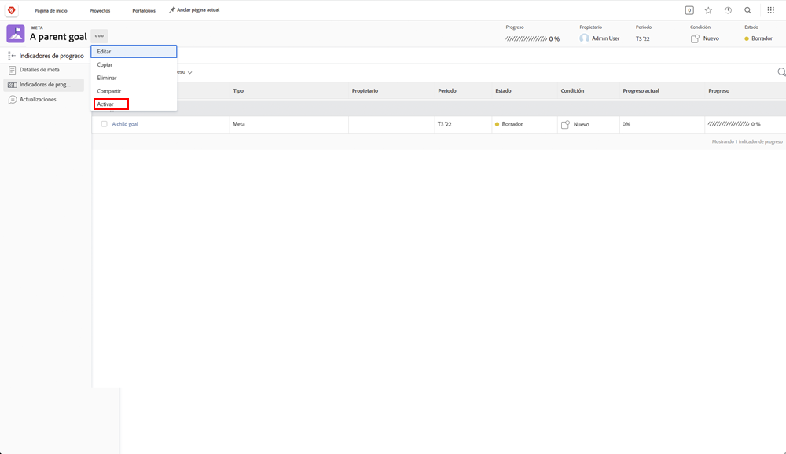

# Activar alineando una meta con otra

Al alinear dos metas, uno se convertirá en la principal y la otra en secundaria. Una meta principal puede tener varias metas secundarias, pero una secundaria solo puede alinearse con una principal.

1. Abra la meta secundaria haciendo clic en su nombre en la [!UICONTROL Lista de metas]. De forma predeterminada, se encuentra en la pestaña [!UICONTROL Detalles de la meta].
1. Haga clic en el botón [!UICONTROL +Añadir] en el panel [!UICONTROL Información de la meta principal].

   ![Captura de pantalla de la pestaña [!UICONTROL Detalles de la meta] ](assets/06-workfront-goals-align-goals.png)

1. Empiece a escribir el nombre de la meta principal deseada en el campo [!UICONTROL Meta principal] y, a continuación, selecciónela cuando aparezca en la lista. En la lista solo aparecen las metas del mismo período o de un período futuro.

   ![Captura de pantalla del panel [!UICONTROL Detalles de la meta] que muestra el panel de [!UICONTROL Información de la meta principal] ](assets/07-workfront-goals-align-to.png)

1. Haga clic en [!UICONTROL Guardar cambios].

Alinear una meta con otra crea una meta secundaria. Considere las metas secundarias como metas individuales que contribuyen al progreso de las principales metas de la organización o del equipo. Las metas secundarias pueden activar e influir en el progreso de la meta principal.

## Ahora, active la meta principal

Ahora que ha creado una meta secundaria, se convierte en un indicador de progreso en la meta principal. Verá la opción Activar cuando haga clic en el menú de tres puntos situado junto al nombre de la meta principal.

