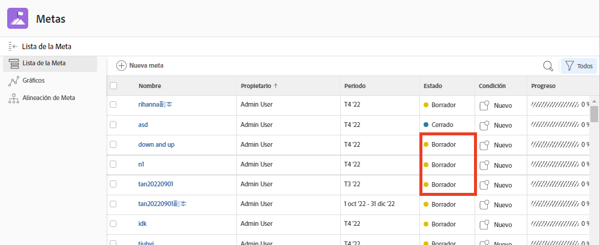
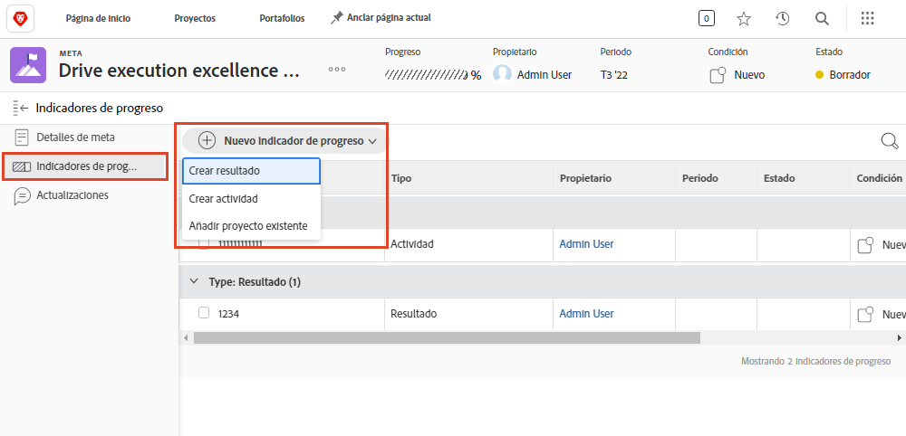

# Activar objetivos en [!DNL Workfront]

Ahora que ha creado objetivos, vamos a activarlos. Cuando crea un objetivo, se guarda en [!UICONTROL Borrador] estado. [!UICONTROL Borrador] los objetivos no forman parte de la administración de objetivos hasta que los active. Una vez activados, cambian a un [!UICONTROL Activo] y mostrar el progreso en el panel y cómo se alinean con la estrategia general. Objetivos en [!UICONTROL Activo] El estado de se asocia a un indicador de progreso, normalmente una actividad o resultado o si el objetivo está alineado con otro objetivo activo (relación de objetivo principal-secundario).

## Indicadores de progreso activar objetivos

Antes de continuar, es importante comprender los indicadores de progreso utilizados en [!DNL Workfront Goals]. Los indicadores de progreso son los objetos de [!DNL Goals] se utiliza para calcular el progreso de un objetivo. Los indicadores de progreso son objetivos, resultados, actividades y proyectos alineados. Más adelante, aprenderá más detalladamente al respecto. Por ahora, es importante entender que los objetivos, resultados, actividades y proyectos alineados deben agregarse a un objetivo para activarlo.

En comparación con otros indicadores de progreso, los proyectos son un poco únicos, ya que se consideran un tipo de actividad. Las actividades se pueden diferenciar en dos tipos: barra de progreso manual y Proyectos. Como resultado, los Proyectos también impulsan el progreso. Aunque todos los tipos de indicadores de progreso se pueden conectar a un objetivo principal, es importante tener en cuenta que existen diferencias en la forma en que se administran.

En la tabla siguiente se muestran las similitudes y diferencias entre los resultados, las actividades y los proyectos, como indicadores de objetivo:

