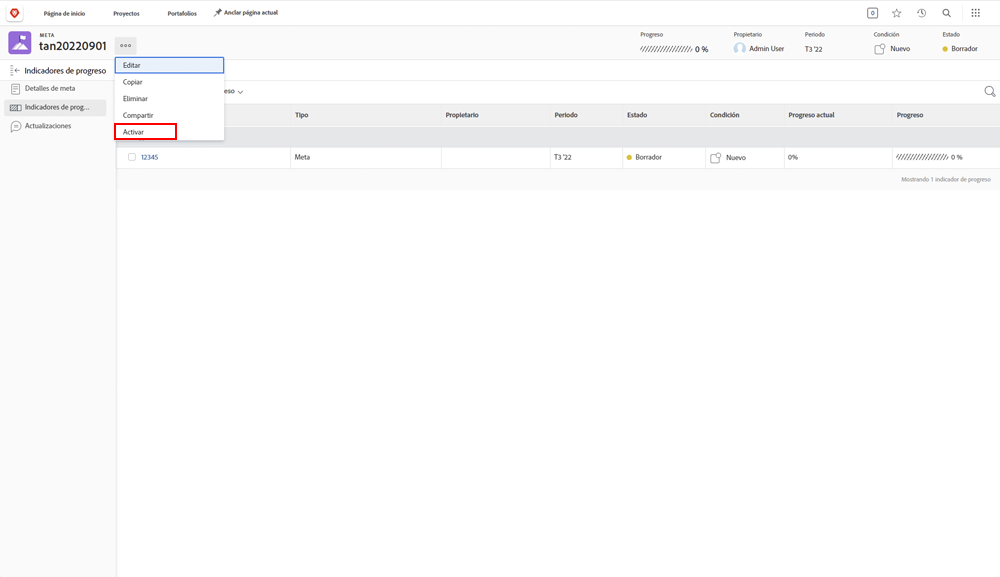

# Activación de metas en [!DNL Workfront]

Ahora que ha creado las metas, se deben activar. Cuando crea una meta, se guarda en el estado [!UICONTROL Borrador]. Las metas en el estado [!UICONTROL Borrador] no forman parte de la administración de metas hasta que las active. Una vez activados, cambian al estado [!UICONTROL Activo] y muestran el progreso en el panel y cómo se alinean con la estrategia general. Las metas en el estado [!UICONTROL Activo] se asocian a un indicador de progreso, normalmente, una actividad, un resultado, un proyecto o una meta alineada (relación de meta principal-secundaria).

## Se necesitan indicadores de progreso para activar las metas

Antes de continuar, es importante comprender los indicadores de progreso que se utilizan en [!DNL Workfront Goals]. Los indicadores de progreso son los objetos de [!DNL Goals] que se utilizan para calcular el progreso de una meta. Los indicadores de progreso son las metas, actividades, los resultados y proyectos alineados. Más adelante obtendrá información detallada sobre estas cuestiones. Por ahora, es importante entender que las metas, resultados, actividades y proyectos alineados deben agregarse a una meta para activarla.

Para añadir un indicador de progreso, abra la meta y seleccione la pestaña Indicadores de progreso situado a la izquierda. A continuación, seleccione el menú desplegable Nuevo indicador de progreso situado junto a él.

En comparación con otros indicadores de progreso, los proyectos son únicos, ya que se considera que son un tipo de actividad. Las actividades se pueden diferenciar en dos tipos: barra de progreso Manual y Proyectos. Como resultado, los proyectos también impulsan el progreso. Aunque todos los tipos de indicadores de progreso se pueden conectar a una meta principal, es importante tener en cuenta que existen diferencias en la forma en que se administran.

## Ahora active la meta

Cuando tenga al menos un indicador de progreso en la meta, verá la opción Activar cuando haga clic en el menú de tres puntos junto al nombre de la meta.

