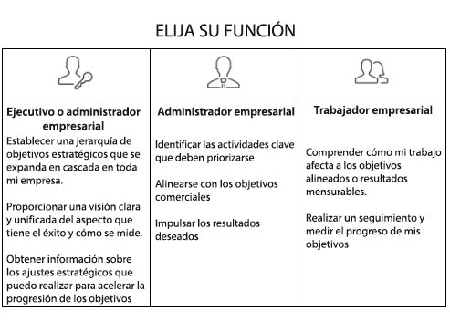

# Configuración de [!UICONTROL Workfront Goals] en su organización

*Esta sección está destinada a los administradores del sistema [!DNL Workfront] responsables de configurar Workfront Goals para sus usuarios.*

Para garantizar que su organización avance rápidamente, debe cerciorarse de que la ejecución del trabajo esté en línea con la estrategia de la compañía. [!DNL   Goals] coordina la estrategia, las metas y el trabajo para impulsar la ejecución en toda la organización y ofrecer resultados empresariales mensurables.

La práctica recomendada para alcanzar las metas comienza con las corporativas de nivel superior y luego desciende a los niveles de grupo, equipo e individuales. Las metas resultantes deben estar en consonancia con las prioridades corporativas, contribuir a su consecución y apoyarlas. En [!DNL Workfront], las metas se complementan con resultados o actividades que indican cómo alcanzarlas.

## Lista de comprobación de [!DNL Workfront Goals] 

Para poder acceder a [!DNL   Goals], se deben cumplir las condiciones siguientes:

* Su organización debe adquirir la licencia de [!DNL Workfront Goals] y de [!DNL Workfront].
* Su organización debe utilizar la nueva interfaz de experiencia de [!DNL Workfront]. [!DNL Workfront Goals] no está disponible en la interfaz clásica de [!DNL Workfront].
* Los usuarios de [!DNL Workfront Goals] deben tener acceso a [!DNL Workfront Goals] en su nivel de acceso.
* Debe asignar una plantilla de diseño que incluya el área [!DNL Workfront Goals] del menú principal para que los usuarios accedan a la funcionalidad.

## ¿Quién puede usar [!DNL Workfront Goals]?

Aunque los colaboradores individuales a menudo tienen metas personales, recomendamos usar [!DNL Workfront Goals] para apoyar la labor de su organización en la consecución de los objetivos estratégicos. Hay que animar a todos los miembros de la organización a fijarse metas que estén alineadas con la estrategia general de la compañía y que se vinculen con sus actividades diarias.

Lea las descripciones de funciones a continuación y determine cuál es su función en [!DNL Workfront Goals].

Los ejecutivos y directivos pueden utilizar [!DNL Workfront Goals] para lo siguiente:

* Establecer una jerarquía de metas estratégicas que se extienda en toda la empresa.
* Proporcionar una visión clara y unificada de cómo se ve el éxito y cómo se cuantifica.
* Obtener datos sobre los ajustes estratégicos que se pueden realizar para acelerar el avance de las metas.

Los colaboradores individuales pueden utilizar [!DNL Workfront Goals] para lo siguiente:

* Alinear sus metas con las iniciativas estratégicas globales de la empresa.
* Medir sus progresos y logros en relación con las metas estratégicas.
* Ajustar las metas personales según sea necesario para mantenerse en consonancia con la dirección del negocio.

