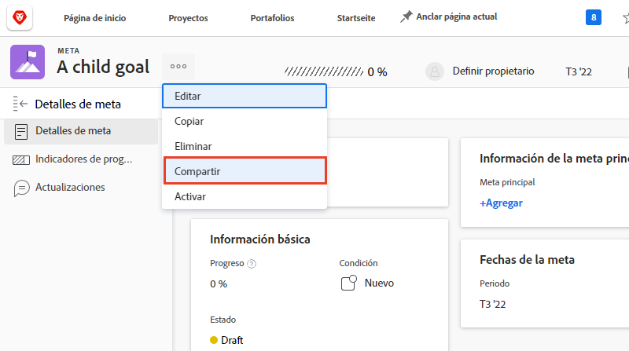

# Comunicar el estado del objetivo

Ahora que ha actualizado sus objetivos utilizando [!UICONTROL Registros], dedique un momento a retroceder y obtenga una vista de pájaro de los objetivos en los que está trabajando y cómo se relacionan con los objetivos de equipo, grupo y compañía. Comunicarse con otros sobre el progreso y el estado de sus objetivos es una parte importante para mantenerse alineados.

Hay varias maneras de mantener a las personas adecuadas actualizadas sobre sus objetivos. Puede empezar por:

* Uso compartido y creación de informes sobre sus objetivos
* Configuración de la vista del [!UICONTROL Pulse] flujo para crear y ver actualizaciones de objetivos individuales
* Aprovechamiento del [!UICONTROL Gráficos] para obtener una instantánea completa del progreso de sus objetivos

## Compartir un objetivo

Puede compartir un objetivo que haya creado o un objetivo creado por otra persona a la que tenga permisos para administrar. No puede compartir objetivos con grupos, equipos o empresas. Si tiene permisos de administración para un objetivo, puede cambiar los permisos del objetivo para el creador del objetivo. De forma predeterminada, la persona que crea el objetivo tiene permisos de administración, pero puede cambiarlos a Vista.

1. Haga clic en el nombre del objetivo que desea compartir en cualquier sección de la [!DNL Goals] para abrir el [!UICONTROL Detalles del objetivo] panel.

1. Haga clic en el icono de 3 puntos junto al nombre del objetivo y, a continuación, haga clic en [!UICONTROL **Compartir**]. La variable [!UICONTROL Acceso a objetivo] se muestra.

   

1. Realice una de las siguientes acciones:

   * Seleccione el [!UICONTROL Administrar en todo el sistema] para otorgar permisos de administración a todas las personas del sistema que tengan acceso de edición a [!DNL Goals] a través de sus [!DNL Workfront] nivel de acceso. De forma predeterminada, esta opción no está seleccionada para todos los objetivos nuevos.
   * Comience a escribir el nombre de un usuario que desee proporcionar [!UICONTROL Administrar] permisos para en [!UICONTROL Dar acceso a Administrar a] en la ventana Seleccione el nombre cuando aparezca en la lista.

1. Haga clic en [!UICONTROL **Compartir**]. Una etiqueta &quot;para todo el sistema&quot; o los nombres de los usuarios que tienen permisos de administración para el objetivo se muestran en la [!UICONTROL Acceso a la administración] en el campo [!UICONTROL Detalles del objetivo] panel.

## Informar sobre la información de objetivo

Puede crear informes de objetivo o de proyecto que incluyan información sobre los objetivos asociados en [!DNL Workfront]. Existen varias formas de ver la información de objetivos en los informes.

* Cree un informe de objetivo en el área Informes . En el informe Objetivo se puede mostrar información diversa sobre el objetivo (por ejemplo: nombre, propietario, fechas, progreso, etc.), que incluye lo siguiente:

   * **Jerarquía de objetivos**: muestra todos los objetivos principales y cómo se conectan entre sí.
   * **Is Company Goal**: indica si su organización está designada como propietaria de un objetivo.
   * **Tipo de propietario**— Indica si el propietario de un objetivo es un usuario, equipo o grupo.

* Cree un informe de proyecto que muestre información de objetivos, que incluya lo siguiente:
   * **Jerarquía de objetivos**: muestra todos los objetivos principales y cómo se conectan entre sí.
   * **Objetivos**: es un campo de recopilación que muestra todos los objetivos asociados a un proyecto.
   * **Número de objetivos vinculados**: número de objetivos asociados con el proyecto.
