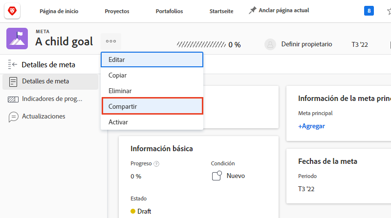

# Comunicar el estado de la meta

Ahora que ha actualizado sus objetivos, tome un momento para retroceder y obtener un vistazo de las metas en las que está trabajando y cómo se relacionan con las metas de equipo, grupo y compañía. Comunicarse con otras personas sobre el progreso y el estado de sus metas es una parte importante para mantenerlas alineadas.

Hay varias maneras de que las personas adecuadas estén actualizadas sobre sus metas. Puede empezar por lo siguiente:

* Uso compartido y creación de informes de sus metas
* Aprovechamiento de la sección [!UICONTROL Gráficos] para obtener una instantánea completa del progreso de sus metas

## Compartir una meta

Puede compartir una meta que haya creado o una creada por otra persona a la que usted tenga permisos para administrar. No puede compartir las metas con grupos, equipos o compañías. Si tiene permisos de administración para una meta, puede cambiar los permisos de esta para el creador de la meta. De forma predeterminada, la persona que crea la meta tiene permisos de administración, pero puede cambiarlos a Vista.

1. Haga clic en el nombre de la meta que desea compartir en cualquier sección del área de [!DNL Goals] para abrir el panel [!UICONTROL Detalles de la meta].

1. Haga clic en el icono de tres puntos junto al nombre del objetivo y, a continuación, haga clic en [!UICONTROL **Compartir**]. Se muestra la casilla [!UICONTROL Acceso a la meta].

   

1. Realice una de las siguientes acciones:

   * Seleccione la configuración [!UICONTROL Administrar en todo el sistema] para otorgar permisos de administración a todas las personas del sistema que tengan acceso de edición a [!DNL Goals] a través de sus niveles de acceso de [!DNL Workfront]. De forma predeterminada, esta opción no está seleccionada para todas las metas nuevas.
   * Comience a escribir el nombre de un usuario que desee proporcionar permisos de [!UICONTROL Administrar] en la casilla [!UICONTROL Dar acceso a Administrar a]. Seleccione el nombre cuando aparezca en la lista.

1. Haga clic en [!UICONTROL **Compartir**]. Una etiqueta “para todo el sistema” o los nombres de los usuarios que tienen permisos de administración para la meta se muestran en el campo [!UICONTROL Acceso a la administración] en el panel [!UICONTROL Detalles de la meta].

## Informar sobre los datos de la meta

Puede crear informes de metas o proyectos que incluyan información sobre las metas asociadas en [!DNL Workfront]. Existen varias formas de ver la información de la meta en los informes.

* Cree un informe de la meta en el área Informes. En el informe de la meta se puede mostrar información diversa sobre esta (por ejemplo: nombre, propietario, fechas, progreso, etc.), que incluye lo siguiente:

   * **Jerarquía de metas**: muestra todas las metas principales y cómo se conectan entre sí.
   * **Si es una meta de la compañía**: indica si su organización está designada como propietaria de la meta.
   * **Tipo de propietario**: indica si el propietario de la meta es un usuario, equipo o grupo.

* Cree un informe de proyecto que muestre información de las metas y que incluya lo siguiente:
   * **Jerarquía de metas**: muestra todas las metas principales y cómo se conectan entre sí.
   * **Metas**: es un campo de recopilación que muestra todas las metas asociadas a un proyecto.
   * **Número de metas vinculadas**: cantidad de metas asociadas con el proyecto.
