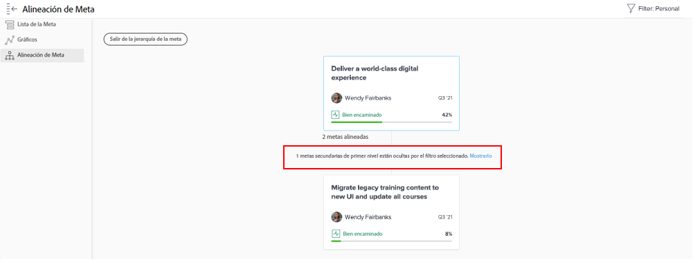

# Vista de actualizaciones de metas individuales

Este vídeo contiene información sobre:

* Vea sus metas individuales en el flujo de actualización [!UICONTROL Pulso]

>[!VIDEO](https://video.tv.adobe.com/v/335200/?quality=12&learn=on)

## Filtrado de información en el flujo Pulso

Puede notar que a veces se obtiene demasiada información en el flujo [!UICONTROL Pulso], o tal vez no la correcta. Filtre la información de la fuente para ver solo lo que quiere o necesita.

1. Haga clic en [!UICONTROL **Pulso**] en el panel izquierdo.
1. Haga clic en el icono [!UICONTROL **Filtro**] en la esquina superior derecha.
1. Seleccione una opción para filtrar. El filtro Todo se aplica de forma predeterminada y muestra todas las metas del sistema. Puede realizar una de las siguientes acciones:

   * Seleccione cualquiera de los filtros predefinidos (enumerados en la sección [!UICONTROL Guardado] del panel de filtros) para mostrar las metas de los propietarios (p. ej., [!UICONTROL Todo], [!UICONTROL Personales], [!UICONTROL Mis equipos], [!UICONTROL Mis grupos] y [!UICONTROL Compañía]).
   * Pase el ratón sobre el nombre de un filtro y, a continuación, haga clic en el icono **Editar** junto al nombre para personalizarlo y añadir nombres específicos de usuarios, equipos, grupos o el nombre de su organización.
   * Haga clic en [!UICONTROL **Nuevo filtro**] para crear un nuevo filtro, seleccione en la lista de opciones para personalizar y filtrar por [!UICONTROL Período], [!UICONTROL Estado], [!UICONTROL Progreso] o [!UICONTROL Propietario].

   ![Una imagen del panel [!UICONTROL Filtros] en [!DNL Workfront Goals]](assets/18-workfront-goals-pulse-stream.png)

**Nota:** Se conserva la selección filtrada y la información de otras secciones de [!DNL Goals] se muestra según esta. Puede buscar y filtrar por metas en varias secciones del área [!DNL Goals] en [!DNL Workfront]:

* [!UICONTROL Lista de metas]
* [!UICONTROL Gráficos]
* [!UICONTROL Impulso]
* [!UICONTROL Alineación de metas]. En esta sección, puede mostrar temporalmente los objetivos que no coinciden con el filtro aplicado para que pueda obtener una visión completa de todos las metas alineadas. Haga clic en la opción [!UICONTROL **Muéstrelo/Muéstrelos**] si hay metas ocultas por el filtro seleccionado.

  
