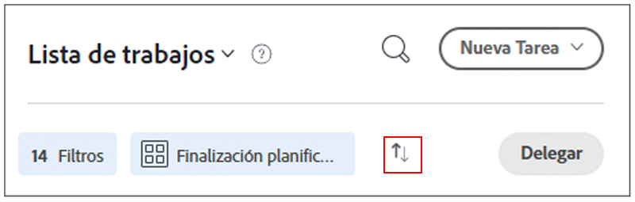

# Organizar la lista de tareas pendientes en [!DNL Workfront] [!UICONTROL Inicio]

>[!NOTE]
>
>El [!UICONTROL [!DNL Sort by]] en la opción [!UICONTROL Lista de trabajos] se ha cambiado a [!UICONTROL Agrupar por], y las tareas y problemas también se pueden agrupar por sus [!UICONTROL Fecha planificada de inicio].

En este vídeo, aprenderá a hacer lo siguiente:

* Ordenar asignaciones de trabajo
* Filtrar asignaciones de trabajo por tipo
* Identificar el trabajo que está listo para iniciarse
* Aceptar asignaciones de trabajo

>[!VIDEO](https://video.tv.adobe.com/v/335099/?quality=12&learn=on)

>[!NOTE]
>
>De forma predeterminada, los primeros elementos vencidos aparecen en la parte superior de la [!UICONTROL Lista de trabajos]. Si desea que los elementos de trabajo aparezcan en orden descendente, haga clic en las flechas a la derecha del área Agrupar por.

