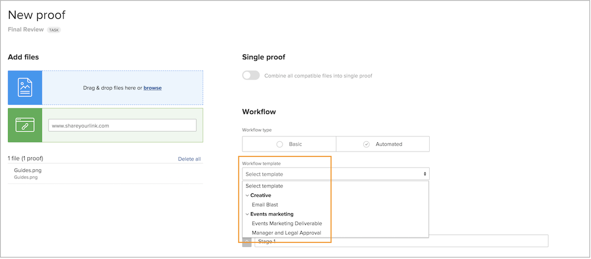

# Crear grupos de plantillas para organizar plantillas de flujo de trabajo automatizadas

Antes de empezar a crear plantillas de flujo de trabajo automatizadas, [!DNL Workfront] recomienda crear grupos de plantillas para organizar las plantillas. Los grupos, considérelos como un bloque para albergar las distintas plantillas, son útiles cuando tiene varios equipos o departamentos que utilizan pruebas, ya que ayudan a mantener las plantillas organizadas para que las personas que asignan procesos de revisión y aprobación sepan qué plantillas utilizar.

Si todavía no está seguro de cómo desea organizar las plantillas en grupos, puede agregar la información del grupo más adelante. Sin embargo, es más fácil asignar un grupo de plantillas a medida que crea una plantilla.

Verá estos grupos no solo en las configuraciones de prueba, sino también al seleccionar una plantilla al aplicar un flujo de trabajo de prueba. Los términos en negrita de la lista de plantillas son los grupos.

Los grupos de plantillas son opcionales. Si su organización solo tiene unas pocas plantillas, es posible que no necesite organizarlas en grupos.

**Para crear un grupo de plantillas**

1. Seleccionar **[!UICONTROL Revisión]** desde el **[!UICONTROL Menú principal]** in [!DNL Workfront].
1. Seleccionar **[!UICONTROL Configuración de cuenta]** una vez abierta el área de configuración de revisión.
1. Ir a **[!UICONTROL Flujos de trabajo]** en el menú del panel izquierdo.
1. Seleccionar **[!UICONTROL Nuevo grupo de plantillas]** desde el **[!UICONTROL Nuevo]** botón.
1. Nombre el grupo.
1. Haga clic fuera del campo para guardar.

El nuevo grupo ahora aparece en la lista.

## Eliminar un grupo

Si elimina un grupo que contiene plantillas, estas se conservan y se mueven a un genérico &quot;[!UICONTROL Plantillas de flujo de trabajo]&quot; grupo. Puede mover las plantillas a otros grupos si es necesario.

<!--
Learn More Icon
Create and manage Automated Workflow templates
-->
