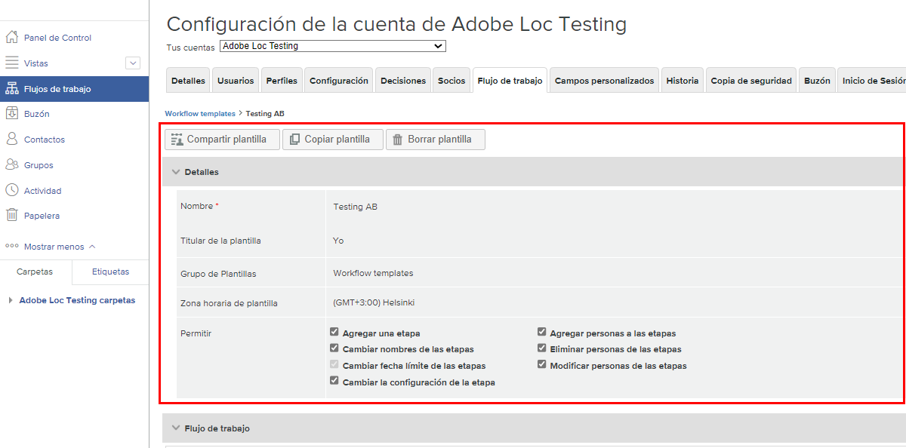

# Edición de una plantilla de flujo de trabajo automatizada

A medida que se refinan los procesos de revisión y aprobación de la prueba o que se realizan cambios organizativos, las plantillas de flujo de trabajo automatizadas deben actualizarse para reflejar las operaciones actuales de sus equipos con Workfront.

Mantener las plantillas actualizadas garantiza la coherencia en los procesos de revisión y aprobación, además de ahorrar tiempo para las pruebas de carga, ya que no se tiene que modificar constantemente un flujo de trabajo.

1. Seleccione **[!UICONTROL Prueba]** del **[!UICONTROL Menú principal]** en [!DNL Workfront].
1. Desde allí, seleccione **[!UICONTROL Flujos de trabajo]** en el menú del panel izquierdo.
1. Haga clic en el menú de tres puntos situado en el extremo derecho del nombre de la plantilla y seleccione **[!UICONTROL Ver detalles de una plantilla]**.

Las opciones para compartir, copiar y eliminar la plantilla se encuentran en la parte superior de la ventana de detalles de cada plantilla. La eliminación de una plantilla no afecta a las pruebas en curso que tengan esa plantilla aplicada, pero significa que ya no está disponible para su uso.

Haga clic en la flecha a la izquierda de la palabra “[!UICONTROL Detalles]” para expandir o contraer la sección.

## Realizar cambios en las etapas y los destinatarios

Puede que sea necesario realizar cambios en el área de [!UICONTROL Flujo de trabajo] cuando un proceso racionalizado implique un plazo de entrega más corto o cuando alguien se incorpore al equipo y vaya a revisar las pruebas.

Cada etapa de un flujo de trabajo automatizado tiene su propia sección, que permite que los plazos, la privacidad, los destinatarios de la prueba y otra información se modifiquen de forma independiente.

Este vídeo muestra algunos de los cambios que puede realizar en el área [!UICONTROL Flujo de trabajo]. Consulte la lista con viñetas bajo este vídeo para revisar esta configuración.

>[!VIDEO](https://video.tv.adobe.com/v/335131/?quality=12&learn=on)

Como revisión, estos son los cambios de plantilla de prueba que puede realizar en la sección [!UICONTROL Flujo de trabajo]:

* Haga clic en el campo nombre de fase o en el campo fecha límite para actualizar esa información.
* Haga clic en la flecha a la izquierda de la fecha límite para bloquear la fase, determinar cuándo se activa o requerir una sola decisión.
* En la lista de destinatarios, haga clic en [!UICONTROL Función] o [!UICONTROL Alertas de correo electrónico] para seleccionar otra opción.
* Vaya al menú de tres puntos situado a la derecha del nombre de un destinatario para eliminarlo de la lista, convertirlo en el principal responsable de decisiones para esa fase del flujo de trabajo o editar la función de prueba y la información de alerta por correo electrónico.
* Tiene dos opciones para agregar destinatarios a la lista.
   1. En la esquina superior derecha de cada sección de fase, vaya al menú [!UICONTROL Más] y seleccione [!UICONTROL Agregar personas a la fase]. Una vez que haya abierto la ventana [!UICONTROL Agregar personas a la fase], haga clic en la fase a la que desee agregarlas. A continuación, introduzca su nombre o dirección de correo electrónico en la lista de destinatarios y asigne una función de prueba y una alerta de correo electrónico. Haga clic en el botón [!UICONTROL Agregar personas] cuando haya terminado.
   1. En la parte superior del área [!UICONTROL Flujo de trabajo], seleccione [!UICONTROL Agregar personas a la fase].

## Uso compartido de plantillas

El área [!UICONTROL Compartido con] muestra los usuarios de prueba que pueden utilizar la plantilla. Elimine las personas que ya no necesiten utilizar la plantilla haciendo clic en el menú de tres puntos situado a la derecha de su nombre y seleccionando [!UICONTROL Eliminar].

![[!UICONTROL Lista Compartido con]](assets/proof-system-setups-edit-template-shared-with.png)

Sin embargo, no puede agregar a personas a la lista de uso compartido desde esta sección. Para ello, vuelva a la parte superior de la ventana de detalles de la plantilla y haga clic en el botón [!UICONTROL Compartir plantilla].

## Más información

[!DNL Workfront] mantiene un historial de auditoría de cuándo se realizaron cambios en la plantilla. Puede ver la fecha, quién realizó el cambio y alguna información breve sobre los cambios realizados.

Esta sección no registra información sobre cuándo se utilizó la plantilla en pruebas.

