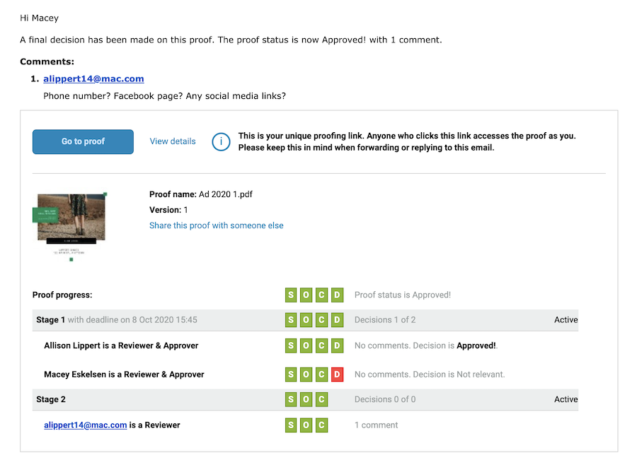

# Comprender las alertas de correo electrónico y las notificaciones de prueba

Las alertas de correo electrónico son diferentes de los correos electrónicos de notificación de prueba. Recibirá un correo electrónico de notificación de prueba cuando se le haya asignado una nueva prueba para revisarla, cuando una se haya retrasado o haya una nueva versión que pueda ver.

Si desactiva la opción de notificación al cargar una prueba, nadie recibe ninguna comunicación de [!DNL Workfront] acerca de la existencia de una nueva prueba para revisar.

Las alertas de correo electrónico se establecen por revisor/aprobador, la mayoría de las veces a medida que se carga la prueba. Puede asignarse un tipo de alerta de correo electrónico predeterminado a los destinatarios de su prueba para que no tenga que configurarlo cada vez que carguen una. Hable con el administrador del sistema para obtener estos valores predeterminados.

Incluso si las alertas de correo electrónico están configuradas como [!UICONTROL Deshabilitadas], los destinatarios siguen recibiendo notificaciones de una nueva prueba o versión.

## Prácticas recomendadas

| Práctica recomendada | He aquí por qué |
|---|---|
| Deshabilite la configuración “Enviar correos electrónicos desde Workfront cuando se haga un comentario en una prueba” en la configuración de Workfront. | Cuando esta configuración está habilitada (que es de forma predeterminada), los usuarios pueden recibir varias notificaciones por correo electrónico para cada comentario en una prueba, una desde la funcionalidad de revisión y otra desde el propio Workfront. Estas duplicidades provocan confusión e interrupciones en los avisos por correo electrónico, así como una bandeja de entrada llena, lo que puede hacer que los usuarios ignoren las notificaciones de prueba. Esto, a su vez, podría suponer el incumplimiento de los plazos.   Nota: Este ajuste se encuentra en el menú principal de Workfront > Configuración > Correo electrónico > Revisión y aprobación. |

