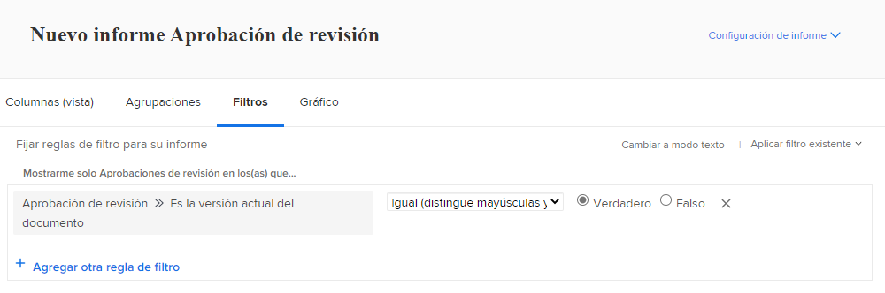
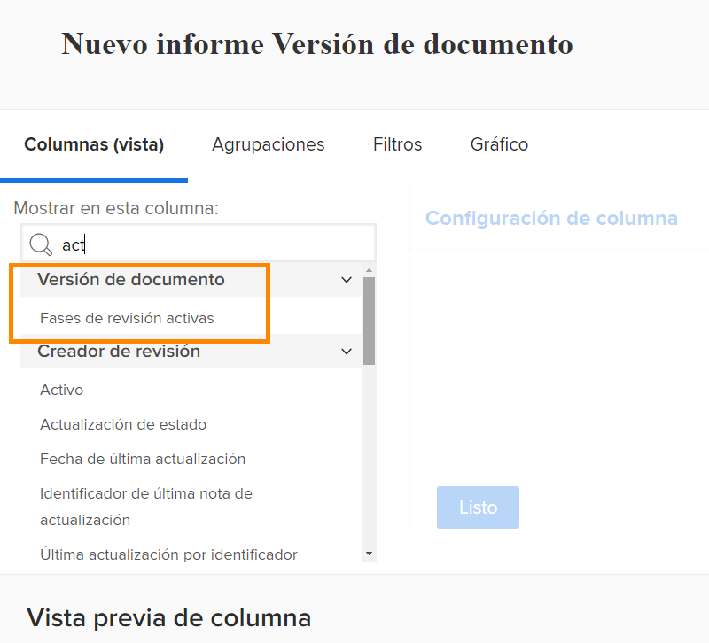
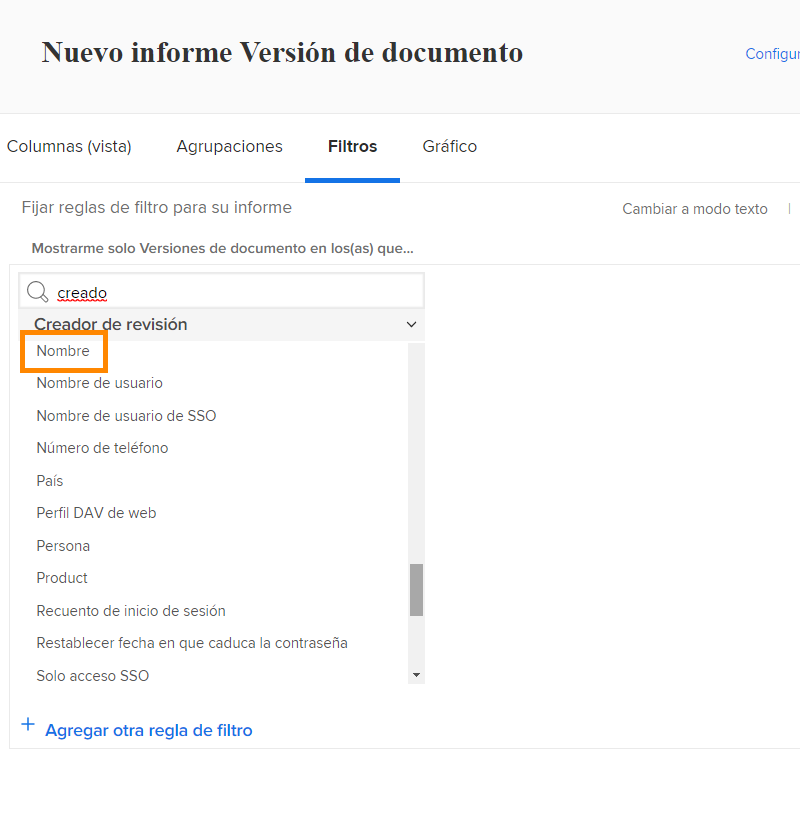

# Informes sobre pruebas

[!DNL Workfront]Las funciones de revisión digital de le permiten administrar proyectos y flujos de trabajo de revisión relacionados, todo en un solo lugar: [!DNL Workfront]. Obtenga información valiosa sobre el trabajo de revisión que se realiza con los tipos de informes, las fuentes de campo y los nombres de campo que muestran información de revisión y aprobación.

Recomendamos trabajar con su [!DNL Workfront] para crear informes que cumplan los requisitos de su organización. Algunos de los informes deben estar familiarizados con [!DNL Workfront]Informes de modo de texto de.

Comience con estos informes básicos y estándar para ayudar a sus equipos a administrar las pruebas que pasan por un proceso de revisión y aprobación en [!DNL Workfront].

## [!UICONTROL Aprobación de revisión]

Este tipo de informe le ayuda a realizar un seguimiento de las aprobaciones de pruebas pendientes para asegurarse de que se cumplen los plazos.

![Seleccionar [!UICONTROL Aprobación de revisión] desde el [!UICONTROL Nuevo informe] menú desplegable](assets/proof-system-setups-proof-approval-report.png)

Las opciones de vista y filtro incluyen [!UICONTROL fecha de decisión], [!UICONTROL aprobación prueba], [!UICONTROL fase de aprobador], [!UICONTROL plantilla de flujo de trabajo], y [!UICONTROL información del solicitante]. Con los informes de modo de texto, puede crear una agrupación que organice la lista por nombre de documento. Consulte [Comprender el modo de texto básico de las agrupaciones](https://experienceleague.adobe.com/docs/workfront-learn/tutorials-workfront/reporting/intermediate-reporting/basic-text-mode-for-groupings.html?lang=en).

Al escribir informes de aprobación de pruebas, asegúrese de obtener información relacionada con la versión más actual de las pruebas. [!DNL Workfront] recomienda incluir este origen de campo y nombre de campo en el filtro:

**[!UICONTROL Aprobación de revisión]>>[!UICONTROL Es la versión actual del documento]**

Esto resulta útil cuando se generan informes sobre pruebas que tienen varias versiones, de modo que el informe solo enumera la versión actual de cada prueba que necesita aprobación. Esto filtra las versiones anteriores en las que ya no necesita trabajar.

## [!UICONTROL Versión de documento]

Este tipo de informe le permite administrar y rastrear versiones en [!DNL Workfront].

![Seleccionar [!UICONTROL Versión del documento] desde el [!UICONTROL Nuevo informe] menú desplegable](assets/proof-system-setups-document-version-report.png)

Ver opciones que incluyen información de [!UICONTROL versión del documento], [!UICONTROL documento], [!UICONTROL ingresado por], [!UICONTROL estado de aprobación de prueba], [!UICONTROL creador de pruebas], y [!UICONTROL proveedor de documentos].

Las agrupaciones se pueden realizar mediante [!UICONTROL versión del documento], [!UICONTROL ingresado por], [!UICONTROL estado de aprobación de prueba]o información sobre el propietario de la prueba.

Los filtros incluyen [!UICONTROL versión del documento], [!UICONTROL nivel de acceso], [!UICONTROL documento], [!UICONTROL ingresado por], [!UICONTROL estado de aprobación de prueba], [!UICONTROL creador de pruebas]y la información del proveedor de documentos.

Puede mostrar el nombre de la fase de revisión que está activa actualmente para cada documento del informe con esta columna en una vista:

**[!UICONTROL Versiones de documento] >> [!UICONTROL Etapas activas de revisión]**

Si no hay ninguna etapa activa actualmente, la columna está en blanco.

Este origen de campo > Nombre de campo también está disponible como filtro en un informe.

Utilice el [!UICONTROL Creador de revisión] origen de campo para informar sobre la información acerca del usuario que creó la prueba. Elija la [!UICONTROL Nombre] origen de campo para mostrar el nombre del creador de la prueba en una vista.

**[!UICONTROL Creador de revisión] >> [!UICONTROL Nombre]**

Esta combinación de origen de campo > nombre de campo también está disponible como filtro.

<!--
Learn More Icon
Learn how to create reports in [!DNL Workfront] with the Report Creation class.
Access to proofing functionality
-->
