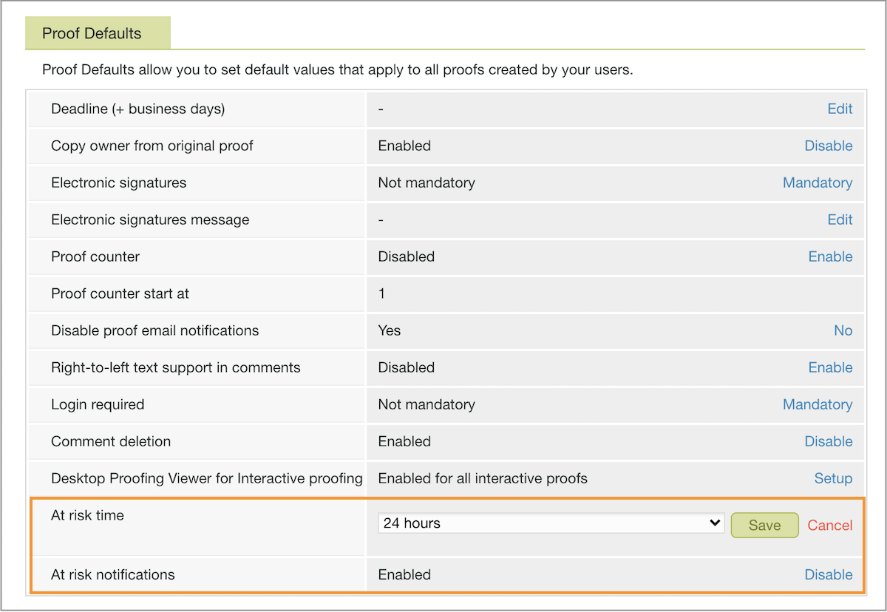

# Establecer el valor predeterminado en la configuración de prueba de riesgo

Debe establecer la configuración para las notificaciones de riesgo que envía [!DNL Workfront]. Estas son un recordatorio amable sobre la próxima fecha límite de la revisión para el propietario de la prueba y los aprobadores que aún no han tomado una decisión.

La notificación de riesgo está activada de forma predeterminada. Una prueba se considera “en riesgo” 24 horas antes de la fecha límite de la revisión. [!DNL Workfront] recomienda dejar activada esta notificación con un período de tiempo de 24 horas. Sin embargo, si el tiempo de respuesta de la prueba en su organización es de horas en lugar de días, es posible que desee acortarlo hasta unas pocas horas.

1. Seleccione **[!UICONTROL Prueba]** del [!UICONTROL Menú principal] de [!DNL Workfront’s].
1. Seleccione **[!UICONTROL Configuración de la cuenta]** en la barra de navegación superior.
1. Seleccione la pestaña **[!UICONTROL Configuración]**.
1. Vaya a la sección [!UICONTROL Valores predeterminados de la prueba].
1. En el campo [!UICONTROL En tiempo de riesgo] campo, seleccione **[!UICONTROL Configuración]**. A continuación, elija el número de horas antes de la fecha límite de la revisión para que se envíe la notificación.
1. Seleccione **[!UICONTROL Guardar]** para esa configuración.
1. Asegúrese de que diga [!UICONTROL Habilitado] en el campo [!UICONTROL Notificaciones de riesgo]. Si no es así, haga clic en el vínculo para activar la configuración.

## Su turno

1. Inicie sesión en Workfront y vaya al área Configuración. En la sección Revisión y aprobación, seleccione la configuración para destinatarios de prueba designados y no destinatarios.
1. Ahora utilice el menú principal de Workfront para ir a la configuración de prueba (seleccione Prueba). Establezca el país, el idioma y la zona horaria como predeterminados para todas las pruebas y usuarios de pruebas.
1. Si es necesario, ajuste el tiempo de notificación en riesgo en la pestaña Configuración del área de configuración de la prueba. Hable con los equipos mediante la prueba para decidir qué funcionará mejor para ellos.

<!--
Lean More URLs
-->
