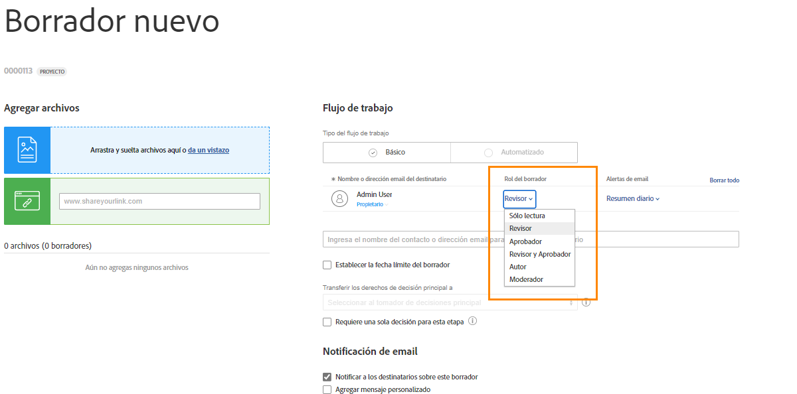
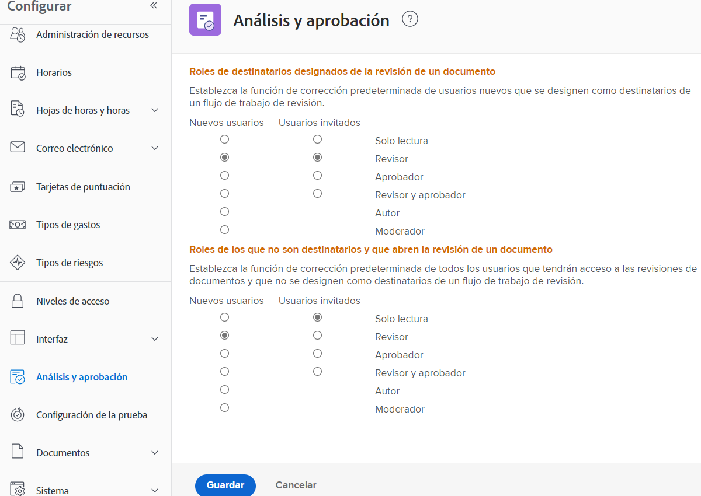

# Establecer roles de prueba predeterminados

La primera configuración predeterminada para completar es determinar una función de prueba predeterminada que se asignará cuando se creen nuevos usuarios o cuando las personas abran una prueba.

Las funciones de prueba determinan lo que un usuario puede hacer con una prueba: basta con verla, realizar comentarios, aprobarla, etc. [!DNL Workfront] recomienda establecer los valores predeterminados de la función de prueba para todos los usuarios, para añadir destinatarios a pruebas y configurar flujos de trabajo de forma más rápida y sencilla.

Sin embargo, esta función de prueba predeterminada se puede cambiar a medida que se cargan pruebas individuales, lo que garantiza que todos puedan cumplir la función que les corresponde en el proceso de revisión y aprobación.

## Establecer roles de prueba predeterminados

1. Seleccione **Configuración** del [!UICONTROL Menú principal].
1. Seleccione **Revisar y aprobar** en el menú de la izquierda.
1. Haga clic en el botón situado junto a la función de prueba predeterminada para los usuarios de [!DNL Workfront] nuevos y usuarios de prueba invitados para “destinatarios designados”: cualquier persona que se añada al flujo de trabajo de prueba, ya sea de forma manual o a través de una plantilla de flujo de trabajo.
1. Haga clic en el botón situado junto a la función de prueba predeterminada para usuarios de [!DNL Workfront] nuevos y usuarios de prueba invitados para usuarios “que no son destinatarios”. Estos son generalmente usuarios de [!DNL Workfront] que tienen acceso a una prueba, pero que no son una de las personas asignadas al flujo de trabajo.
1. Guarde los cambios.

Tenga en cuenta lo que se espera que haga la mayoría de los usuarios e invitados cuando se añadan a un flujo de trabajo de pruebas. Este debería ser su valor predeterminado.

## Prácticas recomendadas

| Práctica recomendada | He aquí por qué |
|---|---|
| Utilice únicamente Solo lectura o Revisor para los ajustes “Funciones para usuarios que no sean destinatarios que abran una prueba de documento” en Workfront. | Las demás opciones para esta configuración requieren que se tome una decisión de la revisión, lo que puede entorpecer el flujo de trabajo de la revisión. Por lo general, las personas que no están añadidas al flujo de trabajo de la revisión solo tienen que ver la prueba o comentar, no aprobar, por lo que las opciones Solo lectura o Revisor son la mejor elección.   Nota: Este ajuste se encuentra en el menú principal de Workfront > Configuración > Revisión y aprobación. |
