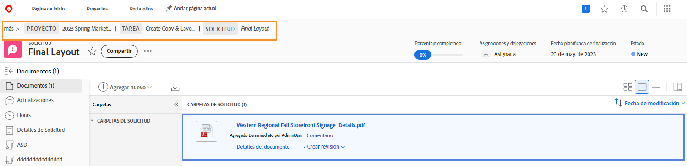

# Explicación de los detalles de la prueba

## Ver detalles de la prueba

Como administrador de pruebas o propietario, puede profundizar en los detalles detrás de una prueba a través del panel de resumen y la página [!UICONTROL Detalles del documento]. Comience por encontrar la prueba en la sección [!UICONTROL Documentos] de un proyecto, tarea o problema.

### Panel de resumen

Seleccione una prueba en la lista de documentos y, a continuación, haga clic en el icono Resumen en la parte superior derecha de la pantalla.

![Imagen de la sección [!UICONTROL Documentos] de un proyecto con una revisión seleccionada.](assets/document-summary-1.png)

A continuación, haga clic en Información general para expandir la sección Información general.

![Una imagen de la sección [!UICONTROL Documentos] de un proyecto con una prueba seleccionada y el panel de resumen ampliado. Tanto el icono del panel de resumen como el panel de resumen están resaltados.](assets/document-summary-2.png)

A continuación, desplácese hacia abajo hasta la sección Revisión. Aquí puede ver el propietario de la prueba, el progreso, el número de comentarios, el estado y la fecha de vencimiento.

![Una imagen de la sección [!UICONTROL Documentos] de un proyecto con una prueba seleccionada y el panel de resumen ampliado. Tanto el icono del panel de resumen como el panel de resumen están resaltados.](assets/document-summary-3.png)

Nota: La sección [!UICONTROL Aprobaciones] del panel de resumen es para **aprobaciones de documento** y **no está** vinculada al proceso de revisión y aprobación de pruebas. Los dos procesos están separados en [!DNL Workfront].

### [!UICONTROL Detalles del documento]

Para obtener más información sobre la revisión, haga clic en [!UICONTROL Detalles del documento].

![Imagen de la sección [!UICONTROL Documentos] de un proyecto con una revisión seleccionada y [!UICONTROL Detalles del documento] resaltados.](assets/document-summary-4.png)

Esto lo lleva a la página [!UICONTROL Detalles del documento] y a una variedad de opciones adicionales en el panel izquierdo.

![Una imagen de la página de la prueba en [!DNL  Workfront].](assets/document-details.png)

Es importante tener en cuenta que la capacidad de ver información relacionada con el proceso de revisión depende de los permisos de revisión en [!DNL Workfront].

Desde la página de la prueba, puede acceder a estas secciones desde el menú del panel izquierdo:

* **Actualizaciones —** Los comentarios realizados en el visor de pruebas aparecen aquí, con la etiqueta &quot;comentario de prueba&quot;. También puede realizar comentarios sobre el archivo, como hace comentarios sobre una tarea o proyecto (estos comentarios no aparecen en el visualizador de pruebas).
* **Aprobaciones:** esta sección es para aprobaciones de documentos, no para aprobaciones de pruebas. Los dos tipos de aprobaciones son procesos independientes en [!DNL Workfront] y no se vinculan entre sí. Si utiliza flujos de trabajo de prueba para sus revisiones y aprobaciones, no utilizará esta sección.
* **Todas las versiones:** rastree y administre el historial de versiones de la prueba. Puede que le resulte más fácil acceder a esta información en el panel de resumen de la lista [!UICONTROL Documentos].
* **Formularios personalizados:** los formularios personalizados se utilizan en pruebas para capturar información específica de la organización. Esta información se puede pasar con el archivo a sistemas de almacenamiento de documentos integrados, como [!DNL Workfront] DAM o Adobe Experience Manager. Los formularios personalizados los configura el administrador del sistema o el administrador del grupo de [!DNL Workfront]. Hable con su equipo o con sus administradores para saber si va a utilizar formularios personalizados en las pruebas.
* **Flujo de trabajo de prueba:** administre o modifique el flujo de trabajo asignado a la prueba. También puede abrir esta ventana mediante el vínculo [!UICONTROL Flujo de trabajo de revisión] en la revisión de la lista [!UICONTROL Documentos].

Veamos con más detalle dos de las secciones: [!UICONTROL Configuración del visor de revisiones] y [!UICONTROL Actividad de revisiones].

### [!UICONTROL Configuración del visualizador de revisión]

Esta configuración le ayuda a controlar el acceso a la propia prueba.

![Una imagen de la [!UICONTROL Configuración del visualizador de pruebas] de la página de la prueba con la opción [!UICONTROL Configuración del visualizador de pruebas] en el menú del panel izquierdo.](assets/proofing-settings-on-details-page.png)

* **[!UICONTROL Inicio de sesión obligatorio. Esta prueba no se puede compartir con usuarios invitados]:** la prueba solo se puede compartir con personas que tengan una licencia de prueba de [!DNL Workfront].
* **[!UICONTROL Requerir que las decisiones se firmen electrónicamente] —** Al compartir una prueba, esto requiere que el destinatario tenga permisos de revisión en [!DNL Workfront] y que los haga &quot;firmar electrónicamente&quot; la prueba al escribir su contraseña de revisión cuando tomen una decisión sobre la revisión. (Nota: La contraseña de revisión debe ser diferente de la contraseña de [!DNL Workfront]. La contraseña de revisión no es fácilmente accesible, por lo que la mayoría de los destinatarios no sabrán esta contraseña). El Adobe recomienda hablar con el consultor de [!DNL Workfront] antes de usar esta función.
* **[!UICONTROL Bloquear la prueba cuando se toman todas las decisiones necesarias]:** esto bloquea la prueba de cualquier otro comentario, respuesta, decisión, etc., una vez que se haya tomado una decisión sobre la prueba. Esto bloquea la versión de prueba completa, no solo una fase específica del flujo de trabajo de revisión.
* **[!UICONTROL Permitir la descarga del archivo original] —** Los destinatarios de la prueba pueden descargar el archivo de origen original de la prueba desde el visor de pruebas.
* **[!UICONTROL Permitir el uso compartido de pruebas mediante una URL pública o código incrustado]:** los destinatarios de la prueba pueden compartir un vínculo de prueba accesible al público con cualquier persona.
* **[!UICONTROL Permitir la suscripción a la prueba a través de una URL pública o código incrustado]:** cualquier persona a la que se le envíe la URL pública puede agregarse a la prueba con su dirección de correo electrónico y su nombre (si no es un usuario de revisión) o su dirección de correo electrónico y contraseña de revisión (si es un usuario de revisión). (Nota: La contraseña de la revisión no es la misma que la contraseña de [!DNL Workfront]).

### [!UICONTROL Actividad de revisión]

Esta página realiza un seguimiento de toda la actividad que se ha producido en la prueba, además de los mensajes de correo electrónico enviados en relación con esta prueba.

![Una imagen de la sección [!UICONTROL Actividad de revisión] de la página de la prueba con la opción [!UICONTROL Actividad de revisión] resaltada en el menú del panel izquierdo.](assets/proofing-activity-in-details.png)

La sección **[!UICONTROL Actividad]** registra cuándo se hicieron los comentarios y se tomaron las decisiones, además de quién fue. También rastrea cuándo se iniciaron las fases del flujo de trabajo de revisión, cuándo un destinatario abrió una prueba por primera vez y otra información que un administrador o propietario de pruebas querrá saber. Estos detalles pueden resultar útiles para averiguar cosas como, por ejemplo, por qué nunca se inició una fase del flujo de trabajo de revisión.

La sección **[!UICONTROL Mensajes]** registra el momento en que se enviaron alertas y mensajes de correo electrónico a los destinatarios, quién los mandó y el contenido. Esto puede resultar útil para solucionar problemas si alguien dice que no recibió un correo electrónico sobre una prueba. Puede consultar si se ha enviado un correo electrónico y cuándo.

El Adobe recomienda que el administrador y el propietario de la prueba se familiaricen con la información de estas dos secciones. Si combina esta información con la comprensión de cómo leer la barra de progreso de [!UICONTROL SOCD], podrá entender y administrar de verdad sus pruebas, sin importar en qué punto del flujo de trabajo de revisión se encuentren.

Una vez que haya terminado de trabajar en la sección [!UICONTROL Detalles del documento], use la ruta de exploración para volver a la sección [!UICONTROL Documentos] del proyecto, tarea o problema al que está adjunta la revisión.

<!--
#### Learn more
* [!UICONTROL Document details] overview
* Add a custom form to a document
* Request document approvals
* Summary for documents overview
* View activity on a proof within [!DNL Workfront]
-->
