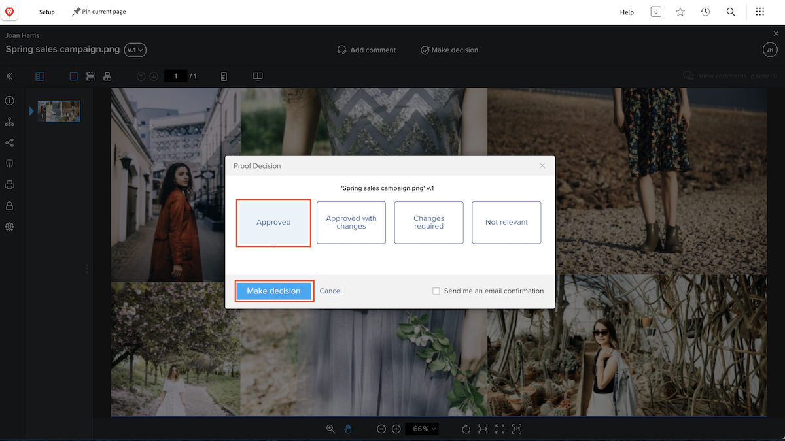

# Revisar y aprobar una prueba

Antes de empezar a revisar una prueba, asegúrese de saber qué se espera de usted. ¿Cuál es su función en el flujo de trabajo de revisión? Revisar la prueba, aprobarla, ¿o ambas cosas?

Como editor de copias, su enfoque podría ser revisar la prueba en busca de errores gramaticales y ortográficos. Los equipos creativos y de marketing pueden centrarse en el diseño del recurso y asegurarse de que se sigue la marca corporativa. Los equipos jurídicos pueden garantizar que la redacción de un contrato de servicios sea adecuada. Además, un administrador de proyectos podría asegurarse de que el contenido que se revisa cumple con la intención y los objetivos del proyecto con el que está asociado.

También se le puede pedir que apruebe la prueba. Aprobar una prueba significa que está diciendo: &quot;este trabajo está bien y listo para ejecutarse&quot;. O tal vez tenga que decir, &quot;este trabajo necesita cambios, por favor envíelo de vuelta para revisiones&quot;.

Una vez que sepa lo que se espera, puede empezar a revisar una prueba.

## Recibir una prueba para revisarla

Cuando un recurso esté listo para su revisión y aprobación, recibirá una notificación por correo electrónico.

![Una imagen de un nuevo correo electrónico de prueba que solicita la revisión y aprobación de dos pruebas en [!DNL &#x200B; Workfront].](assets/new-proof-emails.png)

Es importante tener en cuenta que este vínculo de prueba es único para usted. Si comparte el vínculo con alguien, cualquier comentario o marcado que se haga se etiquetará con su nombre.

El correo electrónico [!UICONTROL Nueva prueba] también contiene información esencial sobre la prueba.

* El nombre de la prueba es el asunto del correo electrónico.
* La miniatura le ofrece una visión rápida de lo que va a revisar.
* El número de versión le permite saber qué versión de la revisión va a ver.
* Y, lo más importante, el plazo aparece en dos lugares del correo electrónico, justo encima de la sección de detalles de la prueba y en la barra gris de la fase del flujo de trabajo de la que forma parte.

Una vez que esté listo para iniciar la revisión, todo lo que tiene que hacer es hacer clic en el botón azul [!UICONTROL Ir a la revisión] y el archivo se abrirá automáticamente en el visor de revisión [!DNL Workfront].

### Abrir una prueba desde el [!UICONTROL Inicio]

Si está trabajando en [!DNL Workfront] y se le ha pedido que apruebe una revisión, encontrará una asignación en el widget [!UICONTROL Mis aprobaciones] de [!DNL Workfront] [!UICONTROL Inicio].

![Imagen del widget [!UICONTROL Mis aprobaciones] en [!DNL Workfront] [!UICONTROL Página principal].](assets/open-proof-from-home.png)

Es importante tener en cuenta que las pruebas solo aparecen en [!DNL Workfront] [!UICONTROL Hogar] si se le ha asignado su aprobación. Si solo se le ha pedido que revise la revisión, no aparecerá en [!DNL Workfront] [!UICONTROL Inicio].

Haga clic en el vínculo [!UICONTROL Ir a la revisión] para abrirlo en el visor de revisión.

Según la prueba de su organización y los flujos de trabajo del proyecto, es posible que vea una asignación de tarea en [!DNL Workfront] [!UICONTROL Inicio] en lugar de una solicitud de aprobación de prueba. En este caso, abrirá la prueba desde la sección [!UICONTROL Documentos] de la propia tarea (consulte las instrucciones a continuación).

También puede encontrar pruebas para revisar el panel de [!DNL Workfront] que se creó específicamente para su equipo u organización para administrar los flujos de trabajo de prueba.

### Abrir una prueba de un proyecto, tarea o problema

Si normalmente trabaja con proyectos, tareas o problemas en [!DNL Workfront], puede que prefiera abrir la prueba directamente desde la sección de [!DNL Documents] de ese elemento.

![Una imagen de la sección [!UICONTROL Documentos] encontrada en una tarea de [!DNL &#x200B; Workfront] con el vínculo [!UICONTROL Prueba abierta &#x200B;]resaltado.](assets/open-proof-from-documents.png)

1. Haga clic en el nombre del proyecto, la tarea o el problema.
2. Haga clic en [!UICONTROL Documentos] en el menú del panel izquierdo de la página del elemento.
3. Busque la prueba en la lista [!UICONTROL Documentos].
4. Haga clic en el vínculo [!UICONTROL Abrir prueba] para abrir el visualizador de pruebas.

## Cómo aprobar una prueba

Después de abrir una revisión, verás un botón **Tomar decisión** en la parte superior, junto a **Agregar comentario**. Si no es aprobador de esta prueba, no verá este botón.

Cuando esté listo para tomar una decisión, haga clic en el botón **Tomar decisión** para ver las opciones de decisión. Seleccione su opción y haga clic en el otro botón **Tomar decisión** que aparece a continuación.

## Revisar y aprobar una prueba

Este vídeo contiene información sobre:

* Saber qué se espera de usted al revisar una prueba
* Escribir un comentario en una prueba
* Utilizar el marcado para indicar los cambios necesarios en una prueba
* Responder a un comentario de una prueba
* Aprobar o rechazar una prueba

>[!VIDEO](https://video.tv.adobe.com/v/335141/?quality=12&learn=on&enablevpops)

<!--
#### Learn more
* Create and manage proof comments
* Make decisions on a proof
* Review a static proof
* Tag users to share a proof
* Notifications for proof comments and decisions
-->

<!--
#### Guides
* Reviewing proofs in [!DNL Workfront]
* -->
