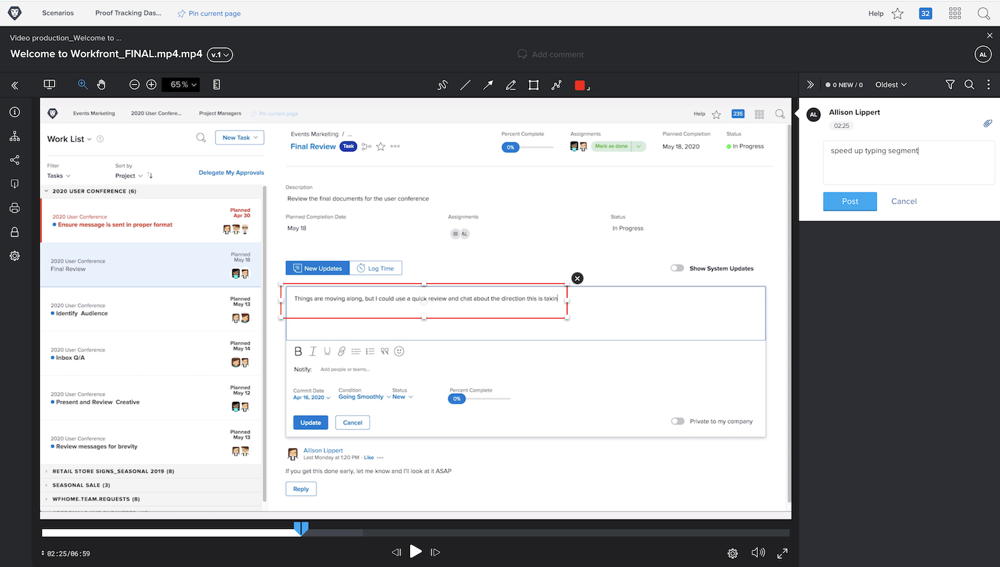

# Cargar una prueba de un vídeo

Las funciones de revisión de [!DNL Workfront’s] no son solo para archivos estáticos como PDF, hojas de cálculo o imágenes. [!DNL Workfront] admite más de 150 tipos de archivos, incluidos vídeos y capturas web de hasta 4 GB de tamaño.

Recuerde que los archivos de mayor tamaño tardan más en cargarse. Asegúrese de que la conexión a internet sea estable antes de iniciar una carga grande, ya que una interrupción podría terminar el proceso.

<!-- For a complete list of uploadable file types, see the article, Supported proofing file types. -->

El visualizador de pruebas de [!DNL Workfront’s] es el lugar ideal para revisar y aprobar archivos de vídeo. Los destinatarios de la prueba pueden reproducir el vídeo directamente en el visualizador de pruebas. Los comentarios tienen marca de tiempo, por lo que se sabe exactamente a qué parte del vídeo se refieren. Los destinatarios de la prueba pueden incluso usar las herramientas de marcado y dibujar directamente en el vídeo pausado.

Entre los tipos de vídeo admitidos están MOV, MP4 y H.264. <!-- Check the supported file types list to make sure the video type you use is compatible with Workfront’s proofing features.-->

Para cargar un vídeo en [!DNL Workfront] se siguen los mismos pasos que para subir un archivo estático.

* Abra el proyecto, la tarea o el problema en el que debe cargarse el vídeo.
* Seleccione [!UICONTROL **Documentos**] en el menú del panel izquierdo.
* En el botón [!UICONTROL **Añadir nuevo**], seleccione [!UICONTROL **Prueba**].
* Arrastre y suelte el archivo de vídeo en el área de carga o utilice la función Examinar.
* Asigne un flujo de trabajo básico o automatizado.
* Establezca una fecha límite.
* Haga clic en [!UICONTROL **Crear prueba**] para terminar.

## Su turno

>[!IMPORTANT]
>
>No olvide alertar a sus compañeros de trabajo que les está enviando una prueba como parte de su formación en Workfront.

Si tiene un archivo de vídeo disponible, cárguelo en un proyecto, tarea o problema de práctica en Workfront. Aplique un flujo de trabajo básico o automatizado similar al que utilizará de normal, o el flujo de trabajo real si ya sabe cuál es.

